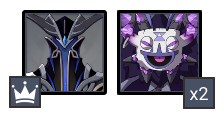

# Floor 12

## General Tips 

With no debuffs or quirks, this version of F12 truly emphasizes strength in teams and DPS.

## Team Recommendations 

|                            |                                                 Side 1                                                |                                       Side 2                                       |
| -------------------------- | :---------------------------------------------------------------------------------------------------: | :--------------------------------------------------------------------------------: |
| **Shieldbreakers**         |                                                             |                                                                                    |
| **Preferred DPS Elements** |                                                          |  |
| **Avoid DPS Elements**     |                                                              |                                          |
| **4**★ **Supports**        |                                                   |                              |
| **5**★ **Supports**        |  |                                                                                    |

Note that CC can be swapped sides if you're finding 12-2-2 difficult to complete in time. The lack of recommended supports is meant to show that there are a wide variety of options in this floor (unlike floor 11).

## Chamber 1

**Monster Level - 90**

### Side 1

| **In Depth Guide**                                                     | Other Info               |
| ---------------------------------------------------------------------- | ------------------------ |
| [Electro Abyss Mage](../../monsters/abyss-order/electro-abyss-mage.md) | INFOGRAPHIC NOT UPDATED. |

Enemies spawn in 2 waves and doesn’t spawn until the previous wave is killed . First wave is 3 Nobushis at the front, and second wave is 3 Pyro Agents and each one spawns at the Front, and the sides. **Crowd Control characters **make this stage easier to clear.

### Side 2

**Bringing a pyro/electro unit **will make dispelling the mimics much easier. The movement of the mimics is based on RNG whereas the geovishap will follow you. **Target the mimics first** and the geovishap will follow you.

## Chamber 2

**Monster Level - 92**

### Side 1

| **In Depth Guide**                                                                | Other Info |
| --------------------------------------------------------------------------------- | ---------- |
| [Magu Kenki Guide](../../monsters/fatui/electro-cicin-mage.md) (Link not updated) |            |
| [Hydrogunner Legionnaire](../../monsters/fatui/hydrogunner-legionnaire.md)        |            |
| [Cryogunner Legionnaire](../../monsters/fatui/cryogunner-legionnaire.md)          |            |

****

### Side 2

| **In Depth Guide** | Other Info |
| ------------------ | ---------- |
|                    |            |

**Crowd Control **is crucial to making this chamber easy to clear. Without it, be aware of **where the hoarders are attacking** as they will freeze you. Note that **Hydro and Cryo are weaker here**.

## Chamber 3

**Monster Level - 100**

### Side 1

| **In Depth Guide**                                         | Other Info |
| ---------------------------------------------------------- | ---------- |
| [Abyss Lector](../../monsters/abyss-order/abyss-lector.md) |            |

There are 2 waves. **Attack the ruin machines first** and let the big machines come to you. 

### Side 2

| **In Depth Guide**                                         | Other Info |
| ---------------------------------------------------------- | ---------- |
| [Abyss Herald](../../monsters/abyss-order/abyss-herald.md) |            |

There are 2 waves. **Attack the ruin machines first** and let the big machines come to you. 
