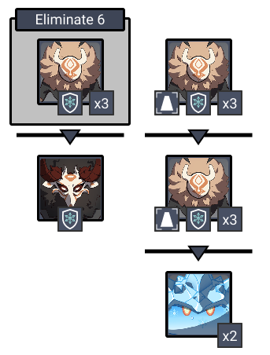
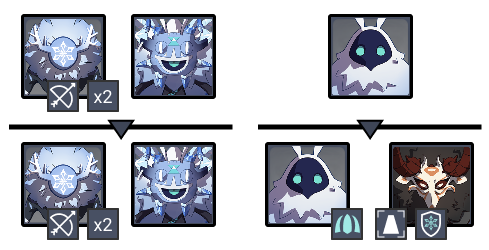
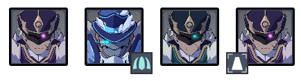
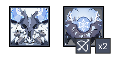
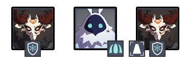

# Floor 9 \(v1.2 - v1.5\)

## Divergence

* Characters on the field will continuously accumulate **Sheer Cold**, and will continually lose HP after Sheer Cold reaches its limit
* Opponents will attack the **Ruin Braziers**, preventing them from diminishing the effects of Sheer Cold in the area. Deactivated Ruin Braziers will restart after a while

## General Tips

Fighting near the braziers is the best strategy, so Sheer Cold shouldn't be much of an issue.

If your **main carry** does **DMG** \(e.g. **Ganyu**\), put them on Side 2 where there are less slimes.

## Team Recommendations

|  | Side 1 | Side 2 |
| :--- | :---: | :---: |
| **Shieldbreakers** |   |   |
| **Preferred Damage** |  |  |
| **Avoid Damage** |  |  |
| **4**★ **Supports** |  |  |
| **5**★ **Supports** |   |  |

## Chamber 1

**Monster Level - 72**

### Side 1

Fight near the **Hilichurls** targetting the **brazier** and the enemies will group together.

### Side 2

| Aura | DMG |
| :--- | :--- |
| \*\*\*\*[**Ice Cage**](../../mechanics/auras/ice-cage.md)\*\*\*\* | 3061 |

Killing the **Cryo Abyss Mage** will immediately spawn another that has an **Ice Cage Aura**. Killing both waves of **Samachurls** and **Archers** before the **Cryo Abyss Mage** will make it easier to clear the floor.

## **Chamber 2**

**Monster Level - 74**

### Side 1

Fight near the **Ice Shield Hilichurls** targetting the **brazier** and let the **Cryo Slimes** come to you. **Grenadiers** need to be killed in order to spawn the next wave of Hilichurls.

### Side 2

| Aura | DMG |
| :--- | :--- |
| \*\*\*\*[**Ice Cage**](../../mechanics/auras/ice-cage.md)\*\*\*\* | 3213 |

The **Electrohammer** on the left will target a heat source and can be ignored until later. Focus the **Cryogunner** to get rid of **Ice Cage**, or the **Anemoboxer** to prevent him from reviving downed enemies.

## **Chamber 3**

**Monster Level - 76**

### Side 1

Get rid of the two **Archers** first, then focus on the **Lawachurl.**

### Side 2

| Aura | DMG |
| :--- | :--- |
| [**Ice Cage**](../../mechanics/auras/ice-cage.md)\*\*\*\* | 3417 |

Focus the **Cyro Abyss Mage** first to get rid of **Ice Cage.**

Fight near the **Mitachurl** targeting the pillar to group them together.

## Other Resources

Not sure what something means? Check the [Glossary](../glossary.md)

