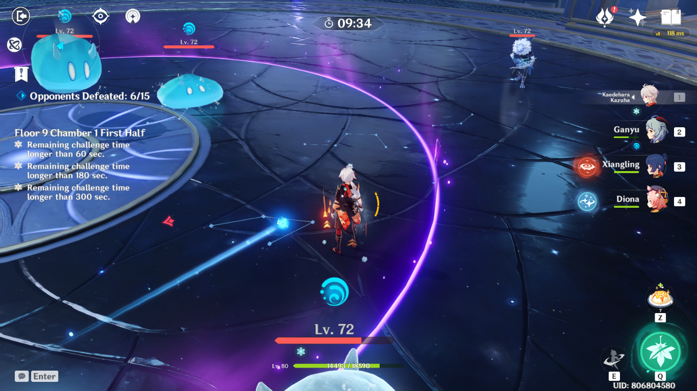
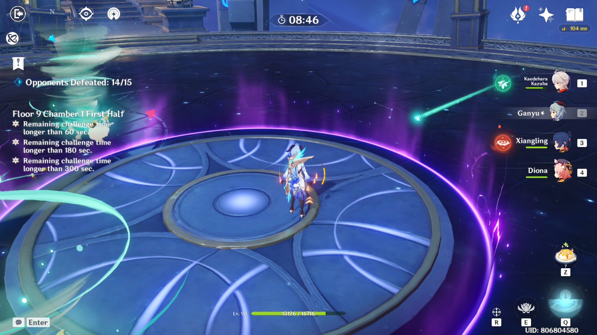

# Floor 9

## Divergence

A **Plasma Field** will be generated at the edge of the challenge area once the challenge begins. 

While within the field, characters will be hit by a **lightning strike** once every **5s** and take **DMG**. 

The area covered by the field will gradually expand as the challenge proceeds.

## General Tips

Each time you clear a wave of enemies, the safe area will get smaller.

Using a **Ranged DPS** can be a good way to avoid getting damaged by the **Plasma Field** effect.

While the damage itself from the **Plasma Field** is low, be careful of enemies that will apply other elemental reactions on you like **Electrocharged** or **Overload**, as these can stagger and interrupt your attacks.

Using ancharacter to group enemies inside the safe area is recommended.

High priority enemies tend to spawn outside the safe area. Focus on those first and return to the center as quickly as you can. Otherwise, you can try to knock them into the center using **charged attacks** or other abilities.

## Plasma Field

The safe area is the towards the **middle** of the arena. After defeating a wave of enemies, the safe area **shrinks** by a set amount.

| **Plasma Field** |  |
| :--- | :---: |
| 1st Wave |  |
| 2nd Wave |   |
| 3rd Wave |   |



The lightning does **459****DMG** per strike, and hits every **5 seconds**.

## Team Recommendations

|  | Side 1 | Side 2 |
| :--- | :---: | :---: |
| **Shieldbreakers** |  |  |
| **Preferred Damage** |  |  |
| **Avoid Damage** |  |  |
| **4**★ **Supports** |  |  |
| **5**★ **Supports** |  |  |

## Chamber 1

**Monster Level - 72**

### Side 1

The **Archers** and **Samachurls** will spawn outside the ring. Focus them first.

In the 3rd wave, focus the **Hydro Samachurl** first, followed by the **Anemo Samachurl**. Lure the **Mitachurl** back into the center to finish it off.

Try not to take any damage from the **Hydro Slimes**. Gettingapplied combined with the **Archer** elements and/or **Plasma Field** can be extremely annoying.

### Side 2

| **In Depth Guide** | Other Info |
| :--- | :--- |
| [Hydro Abyss Mage](../../monsters/abyss-order/hydro-abyss-mage.md) |  |
| [Mist Bubble](../../mechanics/auras/mist-bubble.md) | ?? DMG |

In the second wave, prioritize the **Electro Samachurls** first.

Try to get the **Hydro Abyss Mage** to teleport and end up inside the safe zone. See the [Hydro Abyss Mage](../../monsters/abyss-order/hydro-abyss-mage.md) on how you can control the teleport location.

## Chamber 2

**Monster Level - 74**

### Side 1

| **In Depth Guide** | Other Info |
| :--- | :--- |
| [Cryogunner Legionnaire](../../monsters/fatui/cryogunner-legionnaire.md) |  |
| [Hydrogunner Legionnaire](../../monsters/fatui/hydrogunner-legionnaire.md) |  |
| [Electrohammer Vanguard](../../monsters/fatui/electrohammer-vanguard.md) |  |

Try to group the Fatui together with CC and deal **AoE DMG** to them. Otherwise, focus on the **Hydrogunner** first as he will heal allies.

### Side 2

Make sure to bringon this side to group together the enemies.

The **Potioneers** and **Archers** spawn outside the safe zone. Focus on one of those first and try to group the remaining enemies together.

## Chamber 3

**Monster Level - 76**

### Side 1

| **In Depth Guide** | Other Info |
| :--- | :--- |
| [Frostarm Lawachurl](../../monsters/hilichurls/frostarm-lawachurl.md) |  |

Good **single target** damage is preferred here.

If you have trouble with **Lawachurl** attacks, make sure to bring characters that can break their shields. They are much less aggressive when not shielded.

Some of the attacks can knock you out of the safe area. Make sure to dodge their attacks where possible, or bring shields.

### Side 2

| **In Depth Guide** | Other Info |
| :--- | :--- |
| [Electro Cicin Mage](../../monsters/fatui/electro-cicin-mage.md) |  |
| [Pyro Agent](../../monsters/fatui/pyro-agent.md) |  |

If your main damage isorbased, make sure to bring with **4pc Viridescent Venerer** in order to reduce the enemy resists.

**Jean** even at low investments can be effective at dealing with the enemies by using her **Elemental Skill** to cause fall damage.

The enemies spawn close by at the start. Try to group them together right away and use **AoE DMG** to hit both at once.

