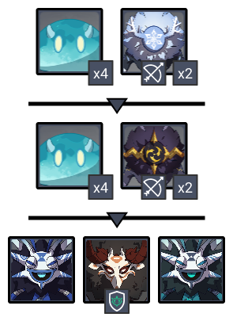

# Floor 9


This page is under construction! Check back shortly!


## Divergence

A **Plasma Field** will be generated at the edge of the challenge area once the challenge begins. 

While within the field, characters will be hit by a **lightning strike** once every **5s** and take **DMG**. 

The area covered by the field will gradually expand as the challenge proceeds.

## General Tips

## Team Recommendations

|  | Side 1 | Side 2 |
| :--- | :---: | :---: |
| **Shieldbreakers** |  |  |
| **Preferred Damage** |  |  |
| **Avoid Damage** |  |  |
| **4**★ **Supports** |  |  |
| **5**★ **Supports** |  |  |

## Chamber 1

**Monster Level - 72**

### Side 1

### Side 2

| **In Depth Guide** | Other Info |
| :--- | :--- |
| [Hydro Abyss Mage](../../monsters/abyss-order/hydro-abyss-mage.md) |  |
| [Mist Bubble](../../mechanics/auras/mist-bubble.md) | ?? DMG |

## Chamber 2

**Monster Level - 74**

### Side 1

| **In Depth Guide** | Other Info |
| :--- | :--- |
| [Cryogunner Legionnaire](../../monsters/fatui/cryogunner-legionnaire.md) |  |
| [Hydrogunner Legionnaire](../../monsters/fatui/hydrogunner-legionnaire.md) |  |
| [Electrohammer Vanguard](../../monsters/fatui/electrohammer-vanguard.md) |  |

### Side 2

## Chamber 3

**Monster Level - 76**

### Side 1

| **In Depth Guide** | Other Info |
| :--- | :--- |
| [Frostarm Lawachurl](../../monsters/hilichurls/frostarm-lawachurl.md) |  |

### Side 2

| **In Depth Guide** | Other Info |
| :--- | :--- |
| [Electro Cicin Mage](../../monsters/fatui/electro-cicin-mage.md) |  |
| [Pyro Agent](../../monsters/fatui/pyro-agent.md) |  |

