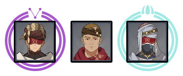

# Floor 9

## Divergence

DMG dealt by the explosion of **Dendro Cores** produced by characters' **Bloom** reaction is increased by **125%**.

DMG dealt by **Burgeon** and **Hyperbloom** reactions triggered by characters is increased by **125%**.


Dendro Cores are created using the **Bloom** reaction by applying +

**Burgeon** is triggered by applyingto cores

**Hyperbloom** is triggered by applyingto cores


## General Tips

If possible, try to bring ancharacter with a CC ability on each side. If you aren't able to do that, then try to used ranged characters where possible. Mobs are spread out and running after them can use up valuable time.

## Team Recommendations

|                            |                                                                                                           Side 1                                                                                                           |                                                                                                        Side 2                                                                                                        |
| -------------------------- | :------------------------------------------------------------------------------------------------------------------------------------------------------------------------------------------------------------------------: | :------------------------------------------------------------------------------------------------------------------------------------------------------------------------------------------------------------------: |
| **Shieldbreakers**         |                                                                                                                                                                                                                            |                                                                                     |
| **Preferred DPS Elements** |                                                                                                                                                                                  |                                                                                                                                                                        |
| **Avoid DPS Elements**     |                                                                                                                                                                                 |                                                                                                                                                                                                                      |
| **4**★ **Supports**        |  |  |
| **5**★ **Supports**        |                                                             |                                                          |

## Chamber 1

**Monster Level - 72**

### Side 1

<figure><figcaption></figcaption></figure>

| In Depth Guide                                                                  | Other Info |
| ------------------------------------------------------------------------------- | ---------- |
| [winged-cryoshroom.md](../../monsters/mushrooms/winged-cryoshroom.md "mention") |            |

Focus on the Floating type Fungi first before they go into the air to reduce the amount of time it takes to clear. They will be thefungi on the first wave, and theon the second.

The enemies spawn on either side. Start with the side that doesn't have slimes, as slimes will eventually group up towards you. Fungi however may stay at range no matter what. Havingwill help you group.

### Side 2

<figure><figcaption></figcaption></figure>

| In Depth Guide                                                                 | Other Info |
| ------------------------------------------------------------------------------ | ---------- |
| [desert-clearwater.md](../../monsters/eremites/desert-clearwater.md "mention") |            |

Havingwill help with this floor as it will group and disable enemies.

Start with the crossbow Eremites and let the other enemies come to you.

## Chamber 2

**Monster Level - 74**

### Side 1

<figure><figcaption></figcaption></figure>

| In Depth Guide                                                                        | Other Info |
| ------------------------------------------------------------------------------------- | ---------- |
| [geo-samachurl.md](../../monsters/hilichurls/samachurls/geo-samachurl.md "mention")   |            |
| [cryo-samachurl.md](../../monsters/hilichurls/samachurls/cryo-samachurl.md "mention") |            |

Aim for the samachurls first in those waves before they summon their pillar and get on top. If they do, try to use a skill that will knock them off rather than waste time destroying it.

You may wantand/orfor shields. However it may be better to just try and attack the Mitachurls between attacks when they are vulnerable and not able to block rather than destroy the shields.

Havingwill help with this chamber.

### Side 2

<figure><figcaption></figcaption></figure>

### Side 1

| In Depth Guide                                                                                                                                                                                                                                                              | Other Info |
| --------------------------------------------------------------------------------------------------------------------------------------------------------------------------------------------------------------------------------------------------------------------------- | ---------- |
| [dendro-samachurl.md](../../monsters/hilichurls/samachurls/dendro-samachurl.md "mention")                                                                                                                                                                                   |            |
| 
 <a data-mention href="../../monsters/abyss-order/hydro-abyss-mage.md">hydro-abyss-mage.md</a> > Slowing Waters (<a data-mention href="../../mechanics/debuffs/">debuffs</a>) > <a data-mention href="../../mechanics/auras/mist-bubble.md">mist-bubble.md</a>
 |            |

Run immediately for the samachurl first and let the slimes group up near you.

Aim for the Abyss Mage with Slowing Waters first, as it this will increase your cooldowns and lower your DPS significantly.

## Chamber 3

**Monster Level - 76**

### Side 1

<figure><figcaption></figcaption></figure>

| In Depth Guide                                                                      | Other Info |
| ----------------------------------------------------------------------------------- | ---------- |
| [winged-dendroshroom.md](../../monsters/mushrooms/winged-dendroshroom.md "mention") |            |
| [winged-cryoshroom.md](../../monsters/mushrooms/winged-cryoshroom.md "mention")     |            |

Focus on the large Fungi and try to finish off the smaller ones with AoE damage.

Havingwill help with this chamber.

### Side 2

<figure><figcaption></figcaption></figure>

| In Depth Guide                                                                                                                                                                    | Other Info |
| --------------------------------------------------------------------------------------------------------------------------------------------------------------------------------- | ---------- |
| 
<a data-mention href="../../monsters/eremites/daythunder.md">daythunder.md</a> > <a data-mention href="../../mechanics/auras/lightning-stake.md">lightning-stake.md</a>
 |            |
| 
<a data-mention href="../../monsters/eremites/sunfrost.md">sunfrost.md</a> > <a data-mention href="../../mechanics/auras/ice-cage.md">ice-cage.md</a>
                   |            |

Aim for the Sunfrost first as Ice Cage is the more deadly aura of the two.

If you are having trouble surviving, try to avoid damaging the Daythunder while you focus the Sunfrost, otherwise it will Enhance. However it can often be more effective to just group them both and rely on AoE damage.

Havingwill help with this chamber.
