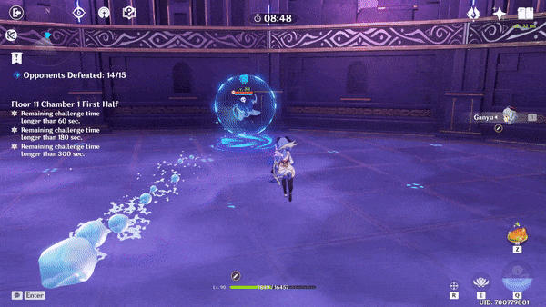

# Bubbles

|  |  |
| :--- | :---: |
| **Damage Type** |   |
| **Timer** | 11.75s |
| **Duration** | 10s |

<table>
  <thead>
    <tr>
      <th style="text-align:left"></th>
      <th style="text-align:left">Tips</th>
    </tr>
  </thead>
  <tbody>
    <tr>
      <td style="text-align:left">
        
      </td>
      <td style="text-align:left">
        
4 bubbles spawn in a &quot;+&quot; pattern around the player.

        

        
Touching them pops the bubble, causing you to take damage.

      </td>
    </tr>
    <tr>
      <td style="text-align:left">
        
      </td>
      <td style="text-align:left">
        
Leaving the initial AoE will cause a second set of bubbles to spawn.

        

        
Be careful not to dash out of the first set and into where the second
          set will spawn.

      </td>
    </tr>
    <tr>
      <td style="text-align:left">
        
      </td>
      <td style="text-align:left">
        
You can destroy the bubbles with attacks and abilities.

        

        
Even if you destroy all the bubbles, leaving the initial AoE will spawn
          the second set.

      </td>
    </tr>
    <tr>
      <td style="text-align:left"></td>
      <td style="text-align:left"></td>
    </tr>
  </tbody>
</table>

