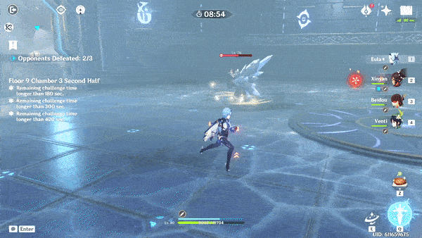
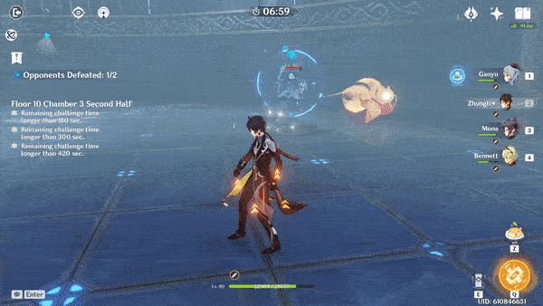

# Elemental Blast

|  |  |
| :--- | :---: |
| **Damage Type** | Variable |
| **Timer** | 15.75s |
| **Blast Delay** | 4.75s |

Before the explosion, a ring will appear that shows the AoE of the blast. Running out of the circle is the most effective way to not get hit.

Alternatively, you can try to time a dodge for when the blast happens. The delay is about 5 seconds from when you see the ring appear, but it is difficult to time right.

The type of damage depends on the enemy, and seems to be related to the **shield**. The blast will apply the corresponding element to you.

