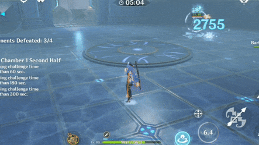
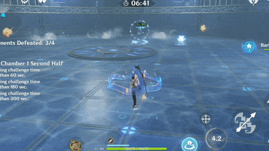
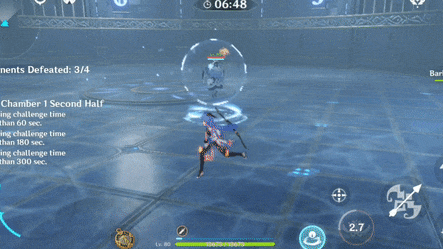
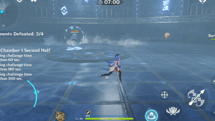

# Ice Cage

|                 |                                              |
| --------------- | :------------------------------------------: |
| **Damage Type** |     |
| **Timer**       |                    11.75s                    |
| **Duration**    |                      2s                      |

Touching the spikes of Ice Cages causes the player to take damage. 

Characters can only take damage once. Switching to another character however can cause them to take additional damage.

If you are caught, the best thing to do is to stop moving. You will take no damage this way. However, enemy attacks can still hit you inside the cage. If this happens, use a **Burst **to avoid the attack.

A snowflake will appear at your feet when an ice cage is about to spawn. Once the snowflake reaches full size, **dodge** to avoid being trapped by the cage.

You can also avoid Ice Cage just by walking! However this will not work if you are slowed by  , or using a short character (Klee, Diona, etc). Dodging is usually more consistent.
