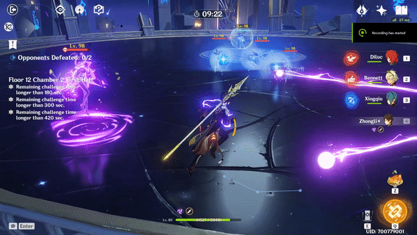

# Lightning Stake

|                    |                                                       |
| ------------------ | :---------------------------------------------------: |
| **Damage Type**    | ****** ** |
| **Timer**          |                         11.75s                        |
| **Duration**       |                           5s                          |
| **Tick Frequency** |                      8 per second                     |

Spawns directly in front of you in a "V" shape. If you stay where you are, you will not be hit by it.

Touching any part of the triangle causes you to take damage quickly, at a rate of **8 ticks/seconds**. \
\
The damage will also cause your character's attacks to be interrupted. Prioritize moving out of it. 

You can **dash** through it to avoid all damage. Make sure you dash straight through it and not at an angle, or you may end your dash still touching it and take damage.
