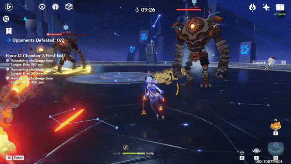

# Shockwave

|  |  |
| :--- | :---: |
| **Damage Type** |   |
| **Timer** | 14.75s |
| **Duration** | 4s per wave |
| **Waves** | 2 |

A red rectangle appears on the player. After a short delay, 2 shockwaves spawn and move toward the player. This repeats one more time.

It is possible to **i-frame** dash through an earthquake and not take any damage. However, doing this in the same direction of the shockwave will still cause you to get hit by the second wave. Always try to dodge to the side of the shockwave.

The aura effect lasts a total of **8 seconds** for both waves. Trying to dodge all the waves can result in a big time loss. It can be more effective to simply shield or heal through the damage and take a few hits.

