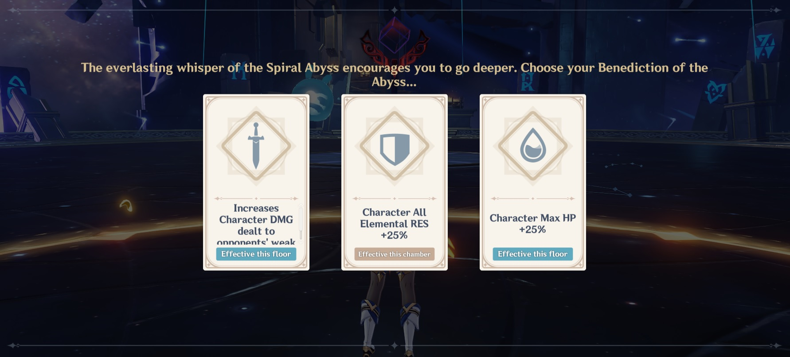

# Buff Cards

## Mechanics

At the beginning of each chamber, you will be given a choice of 3 buff cards (**benedictions**). These come in two types:

* **Effective this floor (blue)** cards. These effects apply to the current chamber, and all remaining chambers in the floor.
* **Effective this chamber (yellow)** cards. These effects only apply to the current chamber.

**Floor Buffs** of the same type stack with each other.

### Reset

The cards you get change **every daily reset** for each Chamber, and will be **different for everyone**. 


The cards are completely random, so it is possible to sometimes get the same choices multiple days in a row.


It is common to use the reset to "stack" the best buffs for the 2nd and 3rd Chambers. If you select a **Floor Buff** and clear that chamber, you can _Leave For Now_ on the next Chamber if the buff cards are not good. Then, if you resume the run the next day after reset, you will have a new set of buffs to choose from and still have the Floor Buff from the previous chamber.

## Choosing your card

### Short version

If you're not using the reset to hand pick specific buffs, then just follow these two guidelines:

* Pick an **Offensive** buff (these will have a Sword icon on them)
* If you're in **Chamber 1 or 2**, choose a **Floor Card**


The **leftmost card will always be an Offensive Floor Buff**. So if you're not sure, just pick that one. Note that not all offensive cards are equally effective for all team comps.


### Long version


The damage comparisons below were done with a sample set of stats as a baseline. The exact amount of the buff will be different, but relative strength should be similar for most teams.


#### Universally good cards

These buff cards are effective for any team and should be picked when possible. The cards are listed in order of preference.

| Buff Card                                                  | Approx. Damage Boost |
| ---------------------------------------------------------- | :------------------: |
| \[Chamber] Character DEF -15% ; ATK +40% \*                |          18%         |
| \[Chamber] When Character HP is less than 50%; ATK +60% \* |          27%         |
| \[Floor] Character Crit Rate +8%; Crit DMG +15%            |          9%          |
| \[Floor] Character ATK +20%                                |          9%          |
| \[Chamber] When Character HP is greater than 50%; ATK +30% |          13%         |

You should only choose \[Chamber] cards on the final chamber, or if you are specifically going for stars on a particular Chamber.

#### Situational cards

These buff cards may only be good for certain team comps and/or will only apply to your damage some of the time, meaning the damage boost will be some amount lower than what is listed.

You'll have to use your own judgement if these would be useful or not for your team.

| **Buff Card**                                                                                                                                                        | Approx. Damage Boost |
| -------------------------------------------------------------------------------------------------------------------------------------------------------------------- | :------------------: |
| \[Chamber] Character Normal Attack SPD +25%                                                                                                                          |          25%         |
| \[Floor] Character Physical DMG +25%                                                                                                                                 |          15%         |
| 
[Floor] Character Elemental Burst DMG +20%

[Floor] Character Elemental Skill DMG +20%

[Floor] Character Normal and Charged Attack DMG +20%

 |          12%         |
| \[Floor] Character Elemental Mastery +80                                                                                                                             |          9%          |
| \[Floor] Character DMG within 8s of sprint +20%. Can occur only once every 15s.                                                                                      |       6% (12%)       |

#### Niche cards

These buff cards are difficult to quantify in terms of damage, but can be useful. Choose them only if there are no options from the above that work for your team.

| Buff Card                                                                             |
| ------------------------------------------------------------------------------------- |
| \[Chamber] Character Elemental Skill and Burst CD -20%                                |
| \[Floor] Character Energy Recharge +20%                                               |
| \[Floor] Increases Character DMG dealt to opponents' weak points by 30%               |
| \[Chamber] Defeating an opponent gives a 50% chance to end current Elemental Skill CD |

#### Defensive cards

Since Abyss content is timed, defensive buffs are not very helpful. It's better to increase your damage and simply retry if you fail than try to add extra defensive stats.

Some characters scale off of stats like **DEF** and **HP**, however these rarely will benefit both teams.

| Buff Card                                                                           |
| ----------------------------------------------------------------------------------- |
| \[Floor] Character DEF +30%                                                         |
| \[Floor] Character Healing Effectiveness is increased by 20%                        |
| \[Floor] Character Max HP +25%                                                      |
| \[Chamber] Character All Elemental RES +25%                                         |
| \[Chamber] Character Cryo RES +35%                                                  |
| \[Chamber] Character Elemental Bursts Instantly restore 30% HP                      |
| \[Chamber] Character Movement SPD +30%                                              |
| \[Chamber] Character Physical DMG RES +30%                                          |
| \[Chamber] Character Sprinting Stamina Cost -30%                                    |
| \[Chamber] Defeating an opponent instantly restores 8% HP for the current character |
| \[Chamber] Instantly restores 25% HP to all party members                           |
| \[Chamber] When Character HP is greater than 50%; DEF +40%                          |

## List of Buff Cards

### Floor Buffs

| Description                                                            |
| ---------------------------------------------------------------------- |
| Character ATK +20%                                                     |
| Character Crit Rate +8%; Crit DMG +15%                                 |
| Character DEF +30%                                                     |
| Character DMG within 8s of sprint +20%. Can occur only once every 15s. |
| Character Elemental Burst DMG +20%                                     |
| Character Elemental Mastery +80                                        |
| Character Elemental Skill DMG +20%                                     |
| Character Energy Recharge +20%                                         |
| Character Healing Effectiveness is increased by 20%                    |
| Character Max HP +25%                                                  |
| Character Normal and Charged Attack DMG +20%                           |
| Character Physical DMG +25%                                            |
| Increases Character DMG dealt to opponents' weak points by 30%         |

### Chamber Buffs

| Description                                                                |
| -------------------------------------------------------------------------- |
| Character All Elemental RES +25%                                           |
| Character Charged Attack Stamina Consumption -50%                          |
| Character Cryo RES +35%                                                    |
| Character DEF -15% ; ATK +40%                                              |
| Character Elemental Bursts Instantly restore 30% HP                        |
| Character Elemental Skill and Burst CD -20%                                |
| Character Movement SPD +30%                                                |
| Character Normal Attack SPD +25%                                           |
| Character Physical DMG RES +30%                                            |
| Character Sprinting Stamina Cost -30%                                      |
| Defeating an opponent gives a 50% chance to end current Elemental Skill CD |
| Defeating an opponent instantly restores 8% HP for the current character   |
| Instantly restores 25% HP to all party members                             |
| When Character HP is greater than 50%; ATK +30%                            |
| When Character HP is greater than 50%; DEF +40%                            |
| When Character HP is less than 50%; ATK +60%                               |

