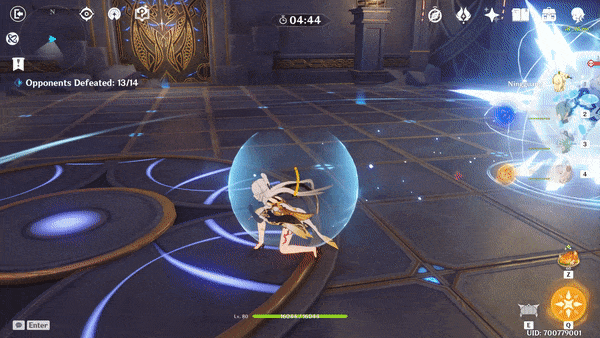
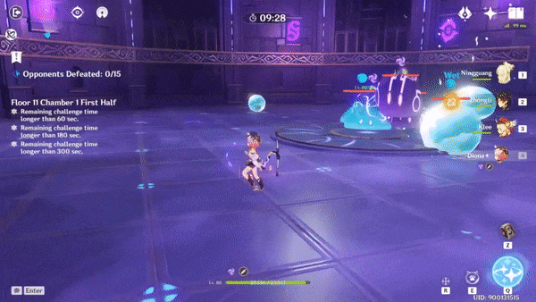

# Debuffs

## Mechanics

Debuffs apply an **element** to the character, as well as a secondary effect based on the element.

| Element | Name | Effect |
| :---: | :--- | :--- |
|  | **Smoldering Flames** | Active character takes **DMG** once every second |
|  | **Condensed Ice** | Increases **Stamina Consumption** by **2x** |
|  | **Slowing Water** | Increases **Skill Cooldowns** by **2x** |
|  | **Engulfing Storm** | Drains **5 energy** every 3 seconds |

All debuffs last **20 seconds**, or until **cleansed** by an elemental reaction \(see [Removing Debuffs](removing-debuffs.md)\).

Debuffs can either come from an **Aura** \(enemy\), or be part of the **Stage** \(divergence in Domain/Abyss\). The two have slightly different mechanics.

|  | Aura | Stage |
| :--- | :--- | :--- |
| **Duration** | 20s | 20s |
| **Timer** | 15s | 30s |
| **Range** | Limited | Unlimited |
| **Affects** | Active Character | Entire Party |

### Aura Debuff

Enemies that inflict debuffs will have a set of **glowing rings** as their **aura** underneath.

Aura debuffs **only affect the active character**. Others in your party will not be debuffed. You can switch to another character and wait out the debuff. You can even intentionally switch to a support to absorb the debuff, and afterwards switch back into your main carry.

The **outer ring** shows the range of the debuff when it activates. You can avoid the debuff by being outside of the circle when it pulses. You **cannot** avoid this using i-frames from a dodge or burst.

Certain abilities are not able to **cleanse** aura debuffs the same as **stage** ones! See [Removing Debuffs](removing-debuffs.md) for more details.

### Stage Debuff

Some stages will periodically apply a **debuff** to an entire team. This cannot be avoided.

