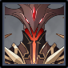

# Abyss Lector (Pyro)

## Resistances

|      Element | Resist |
| -----------: | ------ |
| ALL ELEMENTS | 10%    |

## Tips and Mechanics 

**Weak Point** - Face

**Abyss Lectors** will not move when attacking if you stay close by.

**Abyss Lectors** can be staggered before they shield. You can use this to move them to a favorable position. Once shielded, they can no longer be pushed.

Once **shielded**, try to stay close to the **Abyss Lector** so the **Meteor** attack will land close by. This allows you to use AoE damage to continue hitting both the **shield** and the shard at the same time for maximum damage.

## Shield

Preferattacks to break through the shield.

 attacks will also work, but are **half as effective** as

will also damage the shield, but are **1/4 as effective** as

See [Shields](../../mechanics/shields.md) for more information.


The **Abyss Lector shield** has **72U** of strength. This means it takes anywhere between **18\~36** applications ofto break the shield, depending on how strong the ability is at applying the element. is half as effective, requiring between **36\~72** applications to break the shield, and are a quarter as effective, requiring **72\~144** applications.


## Abilities 

### Fire Blast 


DAfter a delay, deals damage in an AoE around the Lector


### Flaming Orb


Creates an orb which flies towards the player


### Bullet Rain


Creates 5 small orbs which fly towards the player


### Flaming Geyser


Summons 3 pillars of flame, one centered on the player


When **shielded**, summons multiple sets of geysers with every 3rd one appearing underneath the player



### Pyro Shield


Summons a Pyro shield, dealing AoE damage in the process


Once the **Abyss Lector** drops below a certain **HP**, it will summon a  **shield** and deal **DMG** to nearby characters. There is no way to kill the **Abyss Lector** immediately and skip the shield phase.

The **shield** absorbs incoming damage. Destroying the **shield** will immediately kill the **Abyss Lector**, regardless of how much **HP** is left

### Meteor (Shielded)


Summons a meteor which explodes, dealing damage


The **Meteor** leaves behind a shard which can be destroyed. Doing so deals additional damage to the **Abyss Lector**'s shield and briefly staggering it.


