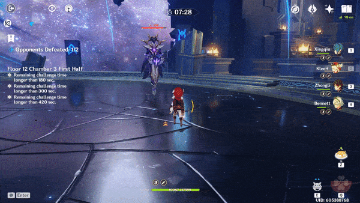
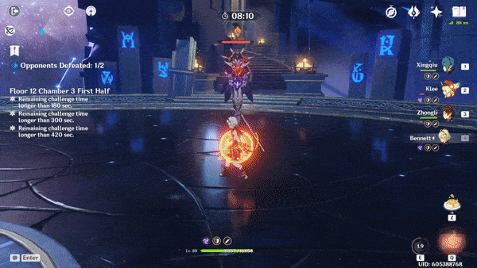
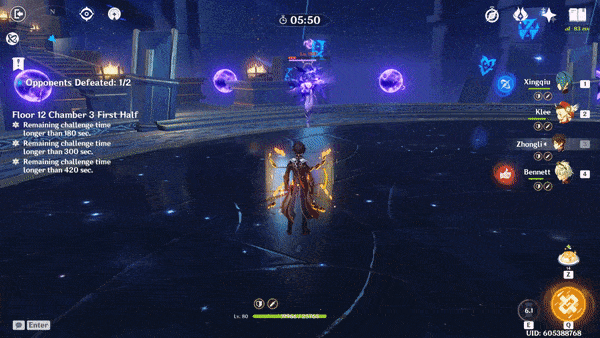
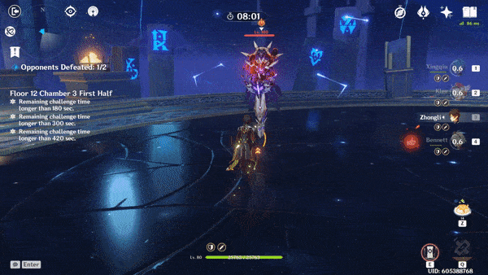
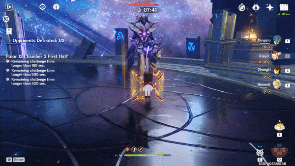

# Abyss Lector

## Resistances

Note - below resistance values are not confirmed.

| ​​ | ​​ | ​​ | ​​ | ​​ | ​​ | ​​ | ​​ |
| :---: | :---: | :---: | :---: | :---: | :---: | :---: | :---: |
| 10% | 10% | 10% | 10% | 10% | 10% | 10% | 10% |

## Tips and Mechanics

**Weak Point** - ****Face

**Abyss Lectors** will not move when attacking if you stay close by.

**Abyss Lectors** can be staggered before they shield. You can use this to move them to a favorable position. Once shielded, they can no longer be pushed.

## Shield

Useattacks to break through the shield.

## Abilities

### Lightning Orbs

Being hit by an orb will drain your character's energy.

### Lightning Streak

### Lightning Bolt

The number of slashes performed during this attack is variable, and based on the **Abyss Lector's health/shield**

| Health | Number of Bolts |
| :--- | :--- |
| Unshielded with over 50% HP | 1 |
| Unshielded with under 50% HP | 2 |
| Shielded with over 50% Shield HP | 3 |
| Shielded with under 50% Shield HP | 4 |

### Explosion

### Electro Shield

Once the **Abyss Lector** drops below a certain **HP**, it will summon a  **shield** and deal **DMG** to nearby characters.

The **shield** absorbs incoming damage. Destroying the **shield** will immediately kill the **Abyss Lector**, regardless of how much **HP** is left

### Charged Orbs

This attack is only performed when **shielded**.

Being hit by an orb will drain your character's energy.

Orbs will remain on the field for about **3 seconds** before disappearing.

