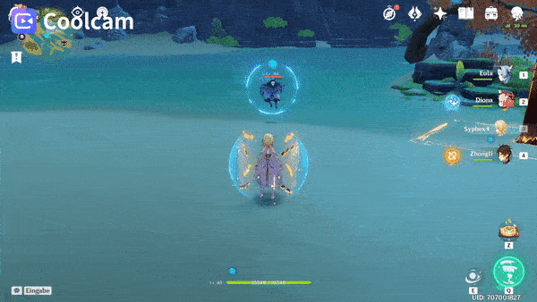
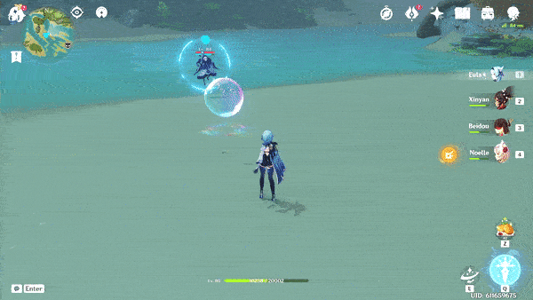
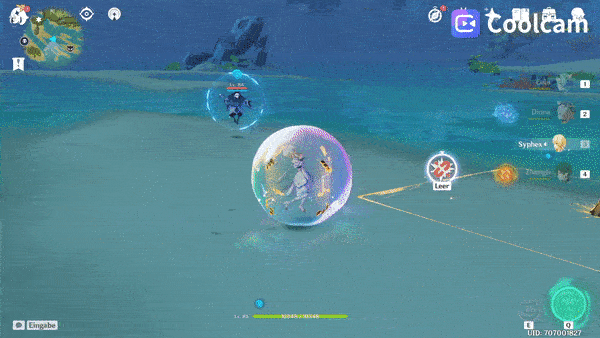
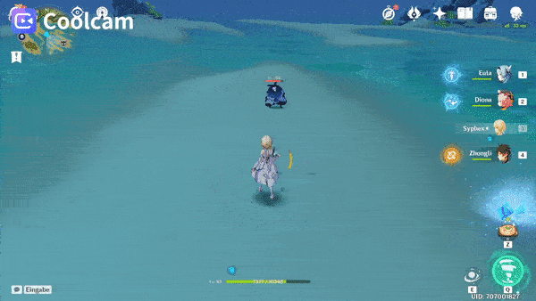
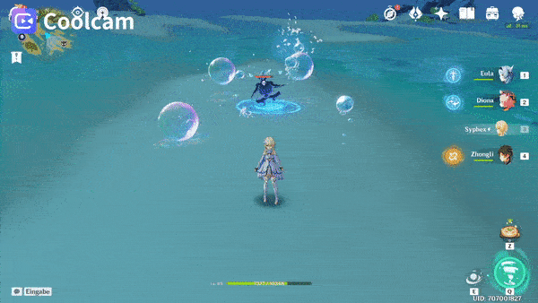

# Hydro Abyss Mage

## Resistances

| ​​ | ​​ | ​​ | ​​ | ​​ | ​​ | ​​ | ​​ |
| :---: | :---: | :---: | :---: | :---: | :---: | :---: | :---: |
| 10% | 10% | 10% | 10% | 10% | 10% | 10% | 10% |

## Tips and Mechanics

**Weak Point** - ****Face

You can use the **Teleport** to reposition **Abyss Mages** to your advantage at the start of some abyss chambers.

Once you drop the shield, make sure to focus the **Abyss Mage** so that they stay staggered. The **Dance** attacks deal a lot of damage, and it can be hard to get close to them while they are active.

## Shield

Preferto break the shield, as this will **Freeze** the **Abyss Herald**.

 attacks will also work, but are less effective than

will also damage the shield, but are **half as effective**.

After the shield is broken, the **Abyss Mage** will be briefly stunned.

## Abilities

### Basic Attack

### Bubble

The bubble will pop if hit by an attack.

The bubble can friendly fire on other enemy units. If possible, put another small enemy in between to avoid the attack and disable that enemy briefly.

The bubble will last about **5 seconds** before disappearing.

### Teleport

Moving a distance away from the **Abyss Mage** will trigger this ability.

The **Abyss Mage** will appear where the player is facing. You can use this to reposition them to your advantage.

### Dance

The **Abyss Mage** will start this attack after some time being stunned.

You can interrupt this attack by stunning/staggering the **Abyss Mage** with certain attacks.

### Shield

After about **8 seconds** of the **Dance** attack, the **Abyss Mage** will reshield.

Make sure to stagger the **Abyss Mage** in some way if you see it using **Dance** to prevent this from happening.

