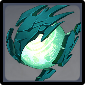

# Eye of the Storm

## Resistances

| ​​ | ​​ | ​​ | ​​ | ​​ | ​​ | ​​ | ​​ |
| :-------------------------------------------------------------------------------------------------------------------------------------------------------------------------------------------------------: | :-------------------------------------------------------------------------------------------------------------------------------------------------------------------------------------------------------: | :-------------------------------------------------------------------------------------------------------------------------------------------------------------------------------------------------------: | :-------------------------------------------------------------------------------------------------------------------------------------------------------------------------------------------------------: | :-------------------------------------------------------------------------------------------------------------------------------------------------------------------------------------------------------: | :-------------------------------------------------------------------------------------------------------------------------------------------------------------------------------------------------------: | :-------------------------------------------------------------------------------------------------------------------------------------------------------------------------------------------------------: | :-------------------------------------------------------------------------------------------------------------------------------------------------------------------------------------------------------: |
|                                                                                                    10%                                                                                                    |                                                                                                    10%                                                                                                    |                                                                                                    10%                                                                                                    |                                                                                                    10%                                                                                                    |                                                                                                   **∞%**                                                                                                  |                                                                                                    10%                                                                                                    |                                                                                                    10%                                                                                                    |                                                                                                  -10**%**                                                                                                 |

## Tips and Mechanics

**Weak Point** - When exposed and on the ground

These enemies cycle through phases of attack and **idle, **where they fall to the ground and can be attacked.

Eye of the Storm's are defeatable with any weapon type, however, **Bow and Catalyst-type **characters will be most effective as they can attack it even when it is off the ground.

 **infused **Eye of Storms can be **frozen, **stopping their attacks.

Though their attacks can deal high damage, they have **easily predictable attack patterns**, allowing dodging to be easy.

## Abilities

### Vacuum Crash


The enemy pulls character in and drops for high single instance hit.



Dodging the attack is a matter of sprinting before the drop.


### Tornado


Enemy pauses and lunges forward quickly.


Dodging is a matter of sprinting out of the line of fire.

### Domain of the Wild Wind


Creates an area of attack dealing consistent Anemo damage. 


A simple attack from a bow or catalyst will stop this attack and cause the enemy to enter a weak state.


Wind currents are created to lift characters off the ground.


If you cannot attack the enemy, you can dodge the damage by following the currents created.

