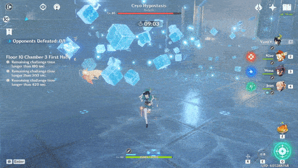
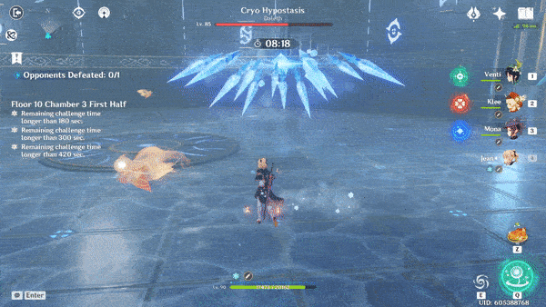

# Cryo Hypostasis

|   |   |   |   |   |   |   |   |
| :----------------------------------------: | :-----------------------------------------: | :----------------------------------------: | :-------------------------------------------: | :-----------------------------------------: | :---------------------------------------: | :------------------------------------------: | :--------------------------------------------: |
|                     10%                    |                     10%                     |                    **∞%**                  |                      10%                      |                     10%                     |                    10%                    |                      10%                     |                       10%                      |

## Tips and Mechanics

**Weak Point** - None

The **Cryo Hypostasis** is continually infused with when the vulnerable.

 **DMG** is the most effective against the **Cryo Hypostasis**, as you will always be able to trigger **Melt** on your attacks, giving **2x** on your attacks at a minimum.

## Abilities

### Clap

The core is vulnerable for about **5 seconds** after the attack ends.

### Ice Wheel

The number of charges performed is random.

Dodging sideways is the most effective way to avoid it.

The core is vulnerable for about **5 seconds** after the attack ends.

### Icicle Field

When this attack starts, you should run towards the **Cryo Hypostasis** and damage it during the attack.

The core is vulnerable for the entire duration of this attack, for a total of about **6 seconds**.

### Ice Ring

The final blast will leave an area on the ground that will deal  **DoT**

Once the first ring hits, dash through the second so you are in position for when the core is exposed.

The core is vulnerable for about **5 seconds** after the attack ends.

### Ice Missiles

Moving towards the core is the easiest way to avoid this attack.

The core is exposed for the duration of this attack if you have skills that can reach it.

The core is vulnerable for an additional **5 seconds** after the attack ends.

### Shield

Once the **Cryo Hypostasis** drops below a certain amount of health, it will automatically enter the shield phase. This cannot be skipped.

During this phase, the core will continually regenerate health and periodically shoot **3 Frostfruits** at the player that land in a spread pattern. This will be followed by an **Ice Missile** attack. It will repeat this pattern  a total of **3 times** before returning to it's normal phase.

Using a **charged attack** on a fallen **Frostfruit** will launch it back at the **Cryo Hypostasis**, doing significant damage to the shield.

Any **Frostfruits** left on the ground when a new volley is shot will disappear, so you need to be quick.

The **Frostfruits** will be shot where the player is standing. This means standing closer to the **Cryo Hypostasis **will cluster the **Frostfruits** closer together, making it easier to run to the next one.

 **DMG** is also effective against the shield. Note that 2 **Frostfruits** will bring the shield low, but not completely destroy it. It's more efficient to finish it off with for the remainder of the shield, rather than trying to use a 3rd **Frostfruit**.

If you break the shield, the **Cryo Hypostasis** will be stunned for** 15 seconds**, during which the core is exposed and can be damaged.
