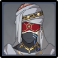

# Sunfrost

<figure><figcaption></figcaption></figure>

|                                        Element | Resist |
| ---------------------------------------------: | ------ |
|  | -20%   |
|                             ALL OTHER ELEMENTS | 10%    |

## Tips and Mechanics 

**Weak Point** - Face

When stunned, Eremite Sunfrosts get **-60%**​**RES**.Like other humanoid enemies, you can CC them with​skills, making them much easier to deal with.

### Enhanced State 



When HP drops below **70%**, Eremite elites will enter an **Enhanced State** which increases their damage and augments some of their attacks.



This buff lasts **20 seconds**, and when the buff ends, they will be momentarily stunned have have reduced resistance matching their element. An icon will flash above their head as the buff ends.

## Abilities

### Charged Slash


Charges up briefly, then performs a horizontal slash


#### Enhanced Charged Slash


When enhanced, deals more damage in a larger AoE


### Slash Combo


Performs two slashes, followed up by a larger 3rd strike


While enhanced, deals more damage in a larger AoE

### Frost Wheel (Enhanced only)


Throws the blades out in a straight line, and returns back to the Sunfrost


### Frost Blade (Enhanced only)


Throws the blade out in a horizontal circle, returning back to the Sunfrost

