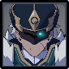

# Anemoboxer

## Resistances

|                                        Element | RES      |
| ---------------------------------------------: | -------- |
|  | **-20%** |
|                             ALL OTHER ELEMENTS | 10%      |

## Mechanics

**Weak point** - Head.

## Tips

Unlike other Fatui, **Anemoboxers** don't use armored Shields, and so are less tanky than the rest. They will often go down easily to AoE damage, as long as you bring their shields down. Their **Shield Dash** also naturally groups them together with other units. Try to aim other units and let them come to you.

If your team has low damage however, killing the **Anemoboxer **first becomes a priority as their **Revive **becomes a problem.

Try to learn the dash timing to avoid the **Vacuum Punch**. In most cases you will want bring down the shield and trigger this move so you can continue dealing damage.

## Abilities

### Punch


Single punch that deals Anemo DMG


### Shield Dash


Dashes quickly at the player or an ally, and puts up a shield


If there are any allies alive, the **Anemoboxer** will prefer to dash towards them. This makes them very easy to group.

The **Anemoboxer** shield is locked in a direction and will block damage from that direction. He is still vulnerable from behind.


When hit with a reaction, drops the shield and performs an infused vacuum punch


Hitting the shield with anyDMG cause the **Anemoboxer **to drop the shield and perform a powered up punch infused with the same element.

This attack can be dodged if you wait until the last moment, however the suction makes it harder to dash out which may leave you vulnerable to other attacks.

Breaking the shield is often a good thing, and you should try to do it as soon as possible. Learn the dodge timing to avoid the punch, or simply kill the **Anemoboxer **while he is charging up.


The shield will be dropped after a few seconds


Waiting for it to be dropped is not recommended for Abyss. Be proactive about taking the shield down.

### Revive


Causes a stunned Fatui to recover, and reshield immediately


A revived Fatui will always use **Shield **immediately. This can be a huge time loss, so try to avoid breaking any shields until all **Anemoboxers **are killed.
