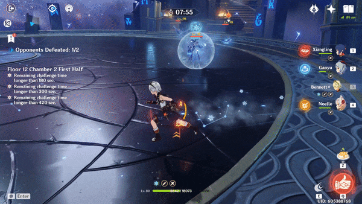
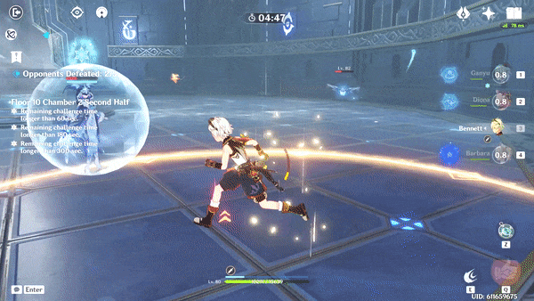
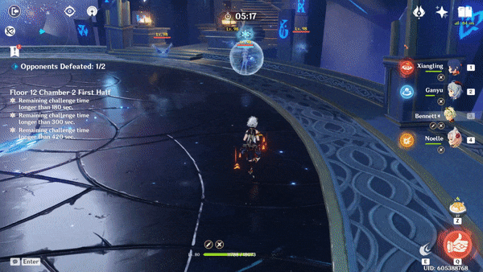

# Cryo Cicin Mage

## Resistances

| ​​ | ​​ | ​​ | ​​ | ​​ | ​​ | ​​ | ​​ |
| :---: | :---: | :---: | :---: | :---: | :---: | :---: | :---: |
| 10% | 10% | **50%** | 10% | 10% | 10% | 10% | **-10%** |

## Tips and Mechanics

**Weak Point** - Face

Most of the **Cryo Cicin Mage's** attacks depend on the summoned **Cicin** flies. Focus on them first. The Cryo versions group together a lot more than the Electro ones and are easier to kill.

Unlike the [Electro Cicin Mage](electro-cicin-mage.md), **Cryo Cicin Mages** can't use **Teleport** if no **Cicin** flies are active. This means it is possible to repeatedly stagger them and prevent them from summon new flies. Chain together effects like **Charged Attacks**, **Overload**, and  skills to keep them permanently staggered.

**Cryo Cicin Mages** don't spawn with any **Cicins**. If you can immediately stagger her, she will never get a chance to shield and you will not even need  for shieldbreaking.

## Abilities

### Summon Cicins

The **Cicin Mage** will not summon **Cicins** unless all of them are killed.

Once all **Cicins** are killed, there is about a **10 second** delay before the **Cicin Mage** summons new ones.

### Shield

The **strength** of the shield is relative to the number of **Cicins** that are active.

The **Cicin Mage** shields frequently while **Cicins** are alive. Prioritize killing the flies if your team isn't able to quickly break the shield.

 is most effective at breaking the shield. 

Note that killing the **Cicins** after the shield is cast does not cause it to go away.

### Teleport

The **Cicin Mage** will sometimes evade attacks by switching places with the **Cicin** flies. If no flies are active, she cannot use this ability!

### Cicin Attack

### Cicin Blast

### Cicin Barrage

