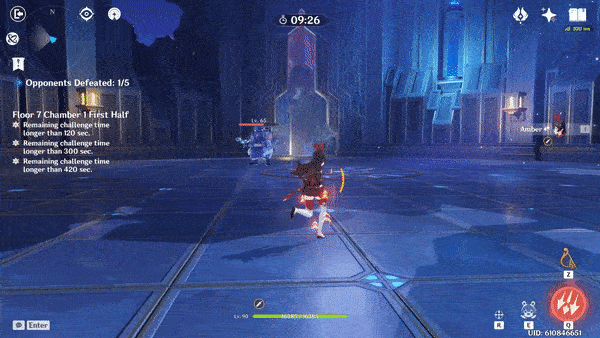
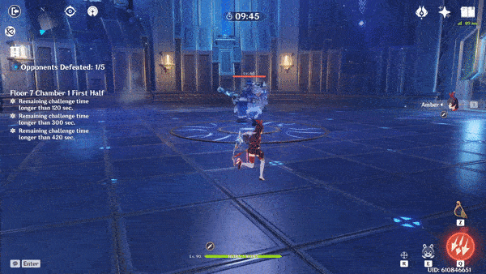
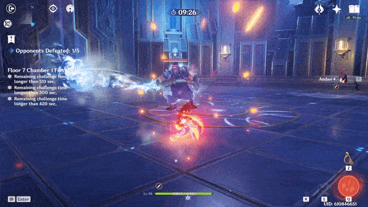

# Cryogunner Legionnaire

## Resistances

|  | ​​ | ​​ | ​​ | ​​ | ​​ | ​​ | ​​ | ​​ |
| :--- | :---: | :---: | :---: | :---: | :---: | :---: | :---: | :---: |
| Normal | 10% | 10% | 10% | 10% | 10% | 10% | 10% | **-20%** |
| Shielded\* | 110% | 110% | 110% | 110% | 110% | 110% | 110% | 90% |

**\*Note - RES** above 100% does not make them immune to the damage. The damage calculation changes for resists above 75%.

**Weak Point** - Face

Unless you are able to take him down before he is able to shield, always bring against the **Cryogunner**. He is extremely resistant to all damage while shielded. Trying to defeat it while the shield is up will lose a lot of time.

The **Jump** ability is easy to avoid by running away from the landing position while the **Cryogunner** is in the air.

The **Spray** attack can do significant damage, particularly once **Shielded**. You can easily run out of it's range to avoid it, or break his **Shield** to interrupt the attack.

## Shield

While shielded, the **Cryogunner Legionnaire** gains **+100% RES** to all types of damage, making it extremely resistant.

is the most effective against the shield.

will also damage the shield, but are **very ineffective**

## Abilities

### Jump

This attack will only be used if the player is a far enough away.

### Spray

When **shielded**, the **Spray** attack will be powered up. The **Cryogunner** will walk towards the player, and will turn to face the player.

The powered up attack will also last much longer than the standard - about **12 seconds** total.

### Shield

Once the shield is broken, the **Cryogunner** will be stunned for about **8 seconds**.

