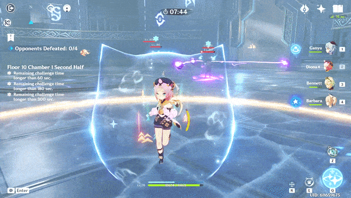
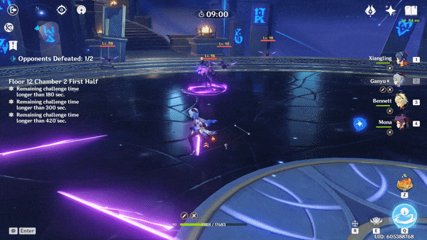

# Electro Cicin Mage

## Resistances

| ​​ | ​​ | ​​ | ​​ | ​​ | ​​ | ​​ | ​​ |
| :---: | :---: | :---: | :---: | :---: | :---: | :---: | :---: |
| 10% | 10% | 10% | **50%** | 10% | 10% | 10% | **-10%** |

## Tips and Mechanics

**Weak Point** - Face

The **Cicins** move widly and are hard to hit, making them mostly a distraction. You should focus on attacking the **Cicin Mage**.

The window when the **Cicin Mage** is charging **Shield** is a good opportunity to deal damage as there are no flies to worry about. Just be ready to either run away or break her shield quickly afterwards to avoid taking lots of damage.

Avoid moving into the **Cicin Mage** during her **Lightning Storm** attack, as this will make it difficult to attack her after due to the ground effect.

**Electro Cicin Mages** are always able to teleport, making it impossible to keep them locked down with regular **staggering** effects. The only way to prevent them from teleporting is to use **Freeze** \( +  \), or lock them in certain  skills.

## Abilities

### Summon Cicins

The **Cicin Mage** can use this ability when there are less than 3 **Cicins** on the field, replenishing back up to 3 total.

### Lightning Storm

The bolts will leave a lingering effect on the ground, dealing  **DMG over Time**.

### Shield

The **Cicin Mage** can still be attacked while summoning her shield. Use this window to deal damage.

Any summoned **Cicins** will disappear when the shield is cast.

After casting the shield, the **Cicin Mage** will move towards you. The shield will periodically deal  **DMG** to nearby enemies.

### Teleport

This is often triggered by repeated attempts to **stagger** the **Cicin Mage**. This makes it impossible to keep her permanently locked down like this.

The teleport often lands directly behind the player

### Cicin Attack

### Cicin Charge

