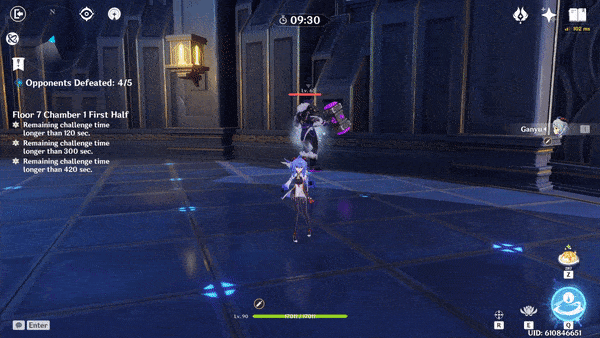

# Electrohammer Vanguard

## Resistances

|            | ​​ | ​​ | ​​ | ​​ | ​​ | ​​ | ​​ | ​​ |
| ---------- | :-------------------------------------------------------------------------------------------------------------------------------------------------------------------------------------------------------: | :-------------------------------------------------------------------------------------------------------------------------------------------------------------------------------------------------------: | :-------------------------------------------------------------------------------------------------------------------------------------------------------------------------------------------------------: | :-------------------------------------------------------------------------------------------------------------------------------------------------------------------------------------------------------: | :-------------------------------------------------------------------------------------------------------------------------------------------------------------------------------------------------------: | :-------------------------------------------------------------------------------------------------------------------------------------------------------------------------------------------------------: | :-------------------------------------------------------------------------------------------------------------------------------------------------------------------------------------------------------: | :-------------------------------------------------------------------------------------------------------------------------------------------------------------------------------------------------------: |
| Normal     |                                                                                                    10%                                                                                                    |                                                                                                    10%                                                                                                    |                                                                                                    10%                                                                                                    |                                                                                                    10%                                                                                                    |                                                                                                    10%                                                                                                    |                                                                                                    10%                                                                                                    |                                                                                                    10%                                                                                                    |                                                                                                  **-20%**                                                                                                 |
| Shielded\* |                                                                                                    110%                                                                                                   |                                                                                                    110%                                                                                                   |                                                                                                    110%                                                                                                   |                                                                                                    110%                                                                                                   |                                                                                                    110%                                                                                                   |                                                                                                    110%                                                                                                   |                                                                                                    110%                                                                                                   |                                                                                                    90%                                                                                                    |

**\*Note - RES** above 100% does not make them immune to the damage. The damage calculation changes for resists above 75%.

## Tips and Mechanics

**Weak Point** - Face

Unless you are able to take him down before he is able to shield, always bring against the **Electrohammer**. He is extremely resistant to all damage while shielded. Trying to defeat it while the shield is up will lose a lot of time.

All of the **Electrohammer **attacks can easily be avoided by dodging **behind** him. Avoid attempting to dodge directly in front, as you may get hit by followup attacks.

## Shield

While shielded, the **Electrohammer **gains **+100% RES** to all types of damage, making it extremely resistant.

While shielded, the **Electrohammer's **attacks will be infused with 

is the most effective against the shield.

will also damage the shield, but are **very ineffective**


The **Electrohammer Vanguard shield** has **4U** of strength. This means it takes anywhere between **2\~4** applications ofto break the shield, depending on how strong the ability is at applying the element.


## Abilities

### Triple Attack

Once started, the** Electrohammer **will continue attacking in the same direction. Dodging **directly behind** during the first swing will avoid the next two swings completely.

### Charge Attack

This attack will only be used if the player is far enough away.

### Slam Attack

### Shield

Once the shield is broken, the **Electrohammer **will be stunned for about **8 seconds**.

