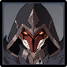
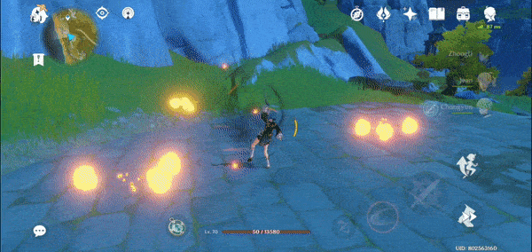
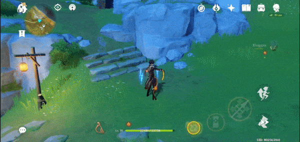
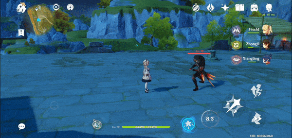
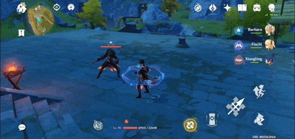
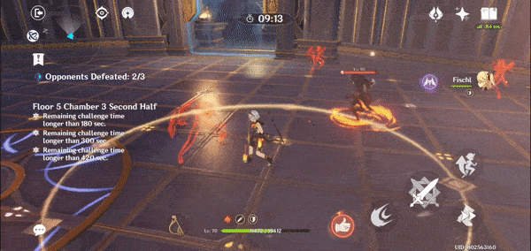
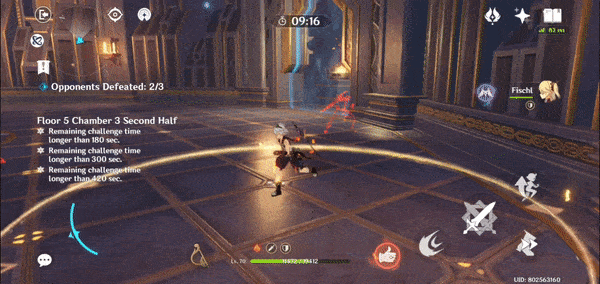
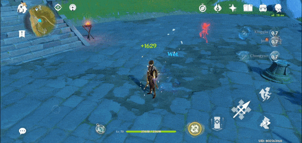

# Pyro Agent

## Resistances

| ​​ | ​​ | ​​ | ​​ | ​​ | ​​ | ​​ | ​​ |
| :---: | :---: | :---: | :---: | :---: | :---: | :---: | :---: |
| **50%** | 10% | 10% | 10% | 10% | 10% | 10% | **-10%** |

## Tips and Mechanics

**Weak Point** - Face

There are very obvious **audio** signals when the **Pyro Agent** is about to attack. Playing with sound on against them is much easier!

**Pyro Agents** do a lot of damage compared to other enemies of a similar level. Most of their attacks are quite telegraphed, so make sure to learn how to dodge them effectively.

**Pyro Agents** are very easy to stagger. You can keep them permanently disabled using things like **charged attacks**, and various  abilities, making them much easier to manage.

### Invisibility

The **Pyro Agent** will go **invisible** after using **Circling Blades**.

If you inflict an **element** on a **Pyro Agent**, they will be easier to see while **invisible**.

Skills that will **stagger** enemies will break **invisibility**. Reactions like **Overload** are another great way to do this.

## Abilities \(Visible\)

### Circling Blades

The **Pyro Agent** will always lead with this attack.

You will not get hit by the blades if you stand directly next to the **Pyro Agent**. You can use a **dash** to get past the blades without being hit.

The **Pyro Agent** is immune to interruption during this attack! If you want to prevent him from going invisible, you will need to stagger him before he casts the blades.

### Dash

### Slash

## Abilities \(Invisible\)

### Remnants

While **invisible**, all attacks made by the **Pyro Agent** will leave a **remnant** \(shadow\) behind.

If you are not able to kill the **Pyro Agent** quickly, you should take the time to destroy the **remnants** when possible.

**Remnants** can also perform a slash attack just before the **Pyro Agent** attacks.

### Dash

### Shadow Strike

### Ultimate

The **Pyro Agent** will use this attack after performing **6 attacks** while **invisible**.

One **dash** attack will be performed for every **remnant** that is on the field. Killing them reduces the number of attacks performed during the combo.

