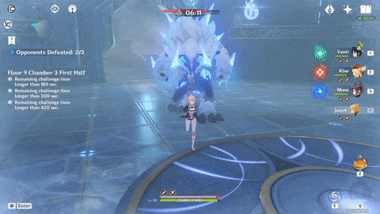
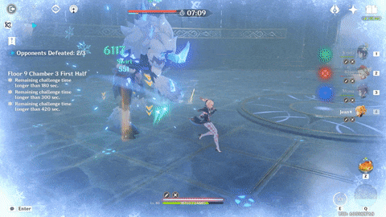
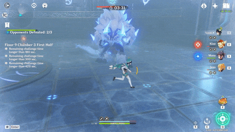
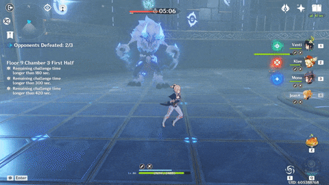
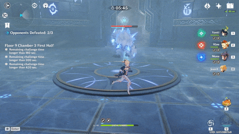
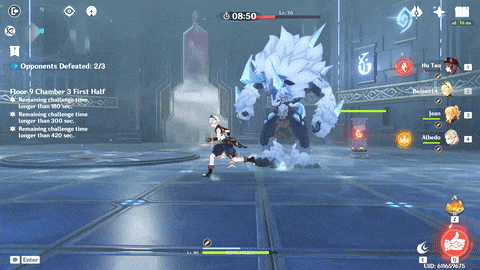
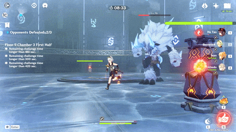

# Frostarm Lawachurl

## Resistances

| ​​ | ​​ | ​​ | ​​ | ​​ | ​​ | ​​ | ​​ |
| :---: | :---: | :---: | :---: | :---: | :---: | :---: | :---: |
| 10% | 10% | **70%** | 10% | 10% | 10% | 10% | **50%** |

## Tips and Mechanics

**Weak Point** - Face

While shielded, the Lawachurl absorbs damage by giving a **80% DMG** penalty to incoming attacks \[[1](https://genshinhelper.gitbook.io/abyss/monsters/frostarm-lawachurl#references)\]. It is also much more dangerous when shielded. Prioritize getting it's shield down.

 is the most effective against the shield, but other reactions and claymore attacks work as well.

The shield naturally decays over time, lasting **90 seconds** if you don't damage it at all.

There is also a **90 second** cooldown on reshielding. This means the **quicker you get the shield down**, the **longer it stays not shielded**. If you are struggling with the Lawachurl, bring multiple chars to bring down the shield faster.

The Lawachurl can still be **Frozen** while shielded, but you will need to apply both  + yourself as the shield does not imbue the Lawachurl with  .

## Attacks \(Shielded\)

### Punch

### Punch and Slam

The slam causes icicles that travel towards the player a short distance.

### Slam

### Double Slam

The second slam takes slightly longer and has a larger AoE.

### Slime Toss

### Charge

Leaves **6 Ice Mines** behind. These explode after **5 seconds** or if touched, dealing **DMG.**

### **Jump Combo**

Combo consists of the following:

* **Leap** attack at the player. This leaves a patch of ground which will deal  **DMG over Time**. This area lasts about **10 seconds**.
* **Slam** Attack
* **Charge** Attack
* **Slam** Attack

## Attacks \(Unshielded\)

### Punch and Slam

The Lawachurl performs this attack about once every **10 seconds**.

### Reshield

After it reshields, the Lawachurl will follow up with a **Jump Combo** attack.

## References

1. [Genshin Fan Wiki](https://genshin-impact.fandom.com/wiki/Hilichurls#Frostarm_Lawachurls)

