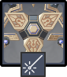
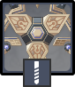
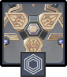

# Primal Constructs

<figure><figcaption></figcaption></figure>

## Resistances 

### Normal

|     Element | Resist |
| ----------: | ------ |
| ALL ELEMENT | 10%    |

### Invisible

|      Element | Resist |
| -----------: | ------ |
| ALL ELEMENTS | 60%    |

## Tips and Mechanics 

Components summoned by each construct are similar to the abilities used by the main machine. Focus on those when summoned as they air fairly weak, and then hit them with anattack to stun the construct.

Unlike other Ruin type enemies, these do not have extraRES. All attacks are equally effective.

### Invisibility

Primal constructs will periodically go invisible, gaining **+50% ALL RES**, and sending out components that will attack you.&#x20;

There are two ways to end invisibility:

* Damage the **Primal Construct Parts** that are sent out to attack you. They cannot be destroyed, but when they run out of HP they will enter **recovery**. Using anattack during this time will paralyze ASIMON and break invisibility.



* Hit the invisible Primcal Construct directly with a **Quicken** reaction (+)



## Abilities

### Prospector - Sweep

<figure><figcaption></figcaption></figure>


Sweeps a pair of beams in front of the construct


### Reshaper - Drill

<figure><figcaption></figcaption></figure>


Summons a drill that strikes from the sky, dealing AoE Damage


### Repulsor - Shield

<figure><figcaption></figcaption></figure>


Fires a shield forwards, pushing the player back

