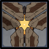

# Ruin Cruiser

## Resistances

|   |   |   |   |   |   |   |   |
| :----------------------------------------: | :-----------------------------------------: | :----------------------------------------: | :-------------------------------------------: | :-----------------------------------------: | :---------------------------------------: | :------------------------------------------: | :--------------------------------------------: |
|                     10%                    |                     10%                     |                     10%                    |                      10%                      |                     10%                     |                    10%                    |                      10%                     |                     **30%**                    |

## Tips and Mechanics

**Weak Point** - Eye Core

The **core** is not exposed often, so watch for the attacks that leave it vulnerable.

**Ruin Cruisers** use ranged attacks. Focus on them first and let other enemies come to you in order to group enemies together.

## Abilities

### Orb Dash


Dashes backwards, leaving behind an energy orb that deals damage.


This attack is only used when you enter **melee** range of the **Ruin Cruiser**.

### Snipe


Locks onto the player, and releases a beam after a delay.


### Tri-Shot


Locks onto the player, and releases three blasts after a delay.


The **core** is **exposed** while this attack is charging. Hit the weak point during to stun it.



While **charged bow** attacks are easiest, any skill that can reach the **core** can be used to stun.

### Bombardment


Charges up, then unleashes multiple waves of energy on an AoE.


The **core** is **exposed** while this attack is charging. Hit the weak point during to stun it.

Once the **bombardment** starts, the **core** cannot be hit anymore. Make sure you hit it during the charge.

