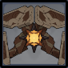

# Ruin Defender

## Resistances

|                                            |                                             |                                            |                                               |                                             |                                           |                                              |                                                |
| :----------------------------------------: | :-----------------------------------------: | :----------------------------------------: | :-------------------------------------------: | :-----------------------------------------: | :---------------------------------------: | :------------------------------------------: | :--------------------------------------------: |
|  |  |  |  |  |  |  |  |
|                     10%                    |                     10%                     |                     10%                    |                      10%                      |                     10%                     |                    10%                    |                      10%                     |                     **50%**                    |

## Tips and Mechanics

**Weak Point** - Eye Core

The **core** is only exposed during the **Cannon** attack. Watch out for it and stun the **Ruin Defender** while it charges that attack.

The **Ruin Defender** is not particularly threatening, but the **Shield** can make it annoying to kill. It's best to focus other enemies during it's **Shield** ability and let it come to you after it's done.

## Abilities

### Shield


Activates a shield, protecting from attacks on the front.


This works similarly to other **physical shields** (see [Shields](../../mechanics/shields.md)). Simply attack it from behind, or use **Freeze** to bypass the shield entirely.

The **Ruin Defender** turns slower than other enemies with physical shields, making it possible to continually run behind it for attacks.

During this ability, the **Ruin Defender** will not move.

This ability lasts about **15 seconds**.

### Shield Smash


Thrusts the shield forward at the player.


This attack is only used when **Shield** is active, and only if you enter \*\*melee \*\*range. There's about a **10 second** cooldown before this ability can be used again.

### Stab


A forward thrusting attack.


### Leap


Jumps into the air and lands, dealing damage in an AoE.


### Cannon


Charges up, then releases an energy blast at the player.


The **core** is **exposed** while this attack is charging. Hit the weak point during to stun it.


