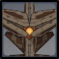

# Ruin Destroyer

## Resistances

|   |   |   |   |   |   |   |   |
| :----------------------------------------: | :-----------------------------------------: | :----------------------------------------: | :-------------------------------------------: | :-----------------------------------------: | :---------------------------------------: | :------------------------------------------: | :--------------------------------------------: |
|                     10%                    |                     10%                     |                     10%                    |                      10%                      |                     10%                     |                    10%                    |                      10%                     |                     **30%**                    |

## Tips and Mechanics

**Weak Point** - Neck Core

**Ruin Destroyers** most attack from a range unless they choose to use **vacuum**, but there is no consistent way to trigger it. Focus **Ruin Cruisers** first, but move towards **Destroyers** next.

## Abilities

### Spin


Sweeping attack.


This attack is only used in **melee** range.

### Volley


Fires 6 shots at the player.


### Drill


Fires a beam into the ground which causes a damaging AoE where the player is.


The **core** is **exposed** while the drill is active. Hit the weak point during to stun it.



### Vacuum


Digs close to the player and performs a vacuum attack, following up with a slam.


The **core** is **exposed** while the vacuum is active. Hit the weak point during to stun it.

