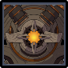

# Ruin Drake: Earthguard

<figure><figcaption></figcaption></figure>

## Resistances

|                                        Element | Resist |
| ---------------------------------------------: | ------ |
|  | 50%    |
|                             ALL OTHER ELEMENTS | 10%    |

## Tips and Mechanics 

**Weak Point** - Core (Eye)

The weak point is only exposed after it absorbs the element and in a small window before using the **Barrage** attack. Unless you can kill it before it does this attack, it is important to bring a character that can hit the Eye and interrupt it during this time.

If your team primarily does damage of a single element, it is very important to interrupt the Barrage attack. If your team has mixed damage, you may be able to ignore it.

### Elemental Absorption

After some time, the Ruin Drake will infuse based on whichever element it has taken the most damage from so far. While infused, it will gain **+40% RES** to that element, as well as performing it's **Barrage** attack infused with the same element.

During this time, the Eye (core) will be exposed. Hitting the eye with certain attacks (e.g. charged attack with a bow with interrupt the attack, as well as removing the Resistance bonus.

### Abilities

### Tail Swipe


Does fast sweeping attack with its tail


### Double Sweep


Two swiping attacks in front of the Ruin Drake


### Charge


Charges at the player, ending with a tail swipe


### Barrage


Charges briefly, then lets off a barrage of projectiles of the absorbed element


During this attack, the Ruin Drake will have **+40% RES** of the absorbed element.



Hitting the eye with certain attacks (e.g. charged attacks with a bow) will stun it, interrupting the attack and removing the Resistance bonus.
