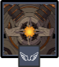

# Ruin Drake: Skywatch

<figure><figcaption></figcaption></figure>

## Resistances

|                                        Element | Resist |
| ---------------------------------------------: | ------ |
|  | 50%    |
|                             ALL OTHER ELEMENTS | 10%    |

## Tips and Mechanics 

**Weak Point** - Core (Chest)

You can still hit the Ruin Drake with most melee/ground attacks when it is hovering. However during Missle/Barrage, it may fly higher up and may no longer be able to be hit by those attacks. It's highly recommended to bring a bow user so you can ground the Ruin Drake when needed.

The weak point is exposed after it absorbs the element and in a small window before using the **Barrage** attack. Unless you can kill it before it does this attack, it is important to bring a character that can hit the Eye and interrupt it during this time.

The Skywatch has an additional missile attack where it's core is exposed. However it does not absorb or infuse any elements during this attack.

If your team primarily does damage of a single element, it is very important to interrupt the Barrage attack. If your team has mixed damage, you may be able to ignore it.

### Elemental Absorption

After some time, the Ruin Drake will infuse based on whichever element it has taken the most damage from so far. While infused, it will gain **+40% RES** to that element, as well as performing it's **Barrage** attack infused with the same element.

During this time, the Eye (core) will be exposed. Hitting the eye with certain attacks (e.g. charged attack with a bow with interrupt the attack, as well as removing the Resistance bonus.

### Abilities

### Volley


Fires a series of bullets in a straight line


### Tail Slam


Sweeps its tail overhead, dealing damage directly in front of the Ruin Drake


### Missile


Locks onto the player, then fires a series of homing missiles


While performing this attack, the Ruin Drake may fly a little higher and be harder to hit with certain attacks.



While charging the attack, the core is exposed. Hitting it with certain attacks (e.g. charged attack with a bow) will stun the Ruin Drake, making it fall to the ground.

### Barrage


Charges briefly, then lets off a barrage of projectiles of the absorbed element


During this attack, the Ruin Drake will have **+40% RES** of the absorbed element, and will hover a bit higher in the air, making it harder to hit with melee attacks.



Hitting the eye with certain attacks (e.g. charged attacks with a bow) will stun it, interrupting the attack and removing the Resistance bonus.
