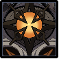
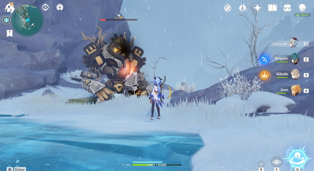

# Ruin Grader

## Resistances

|   |   |   |   |   |   |   |   |
| :---: | :---: | :---: | :---: | :---: | :---: | :---: | :---: |
| 10% | 10% | 10% | 10% | 10% | 10% | 10% | **70%** |

## Tips and Mechanics

**Weak Point** - Leg Core \(x2\), Eye Core \(x1\). Weak points are only exposed during attacks.

Ruin Graders have extremely high  **RES**. Avoid using any **PHYS** based carry \(e.g. **Razor**\) if possible when fighting them. If you do, always bring **Superconduct** \( + \) ****to reduce their resistance by **40%.**

After hitting the **Eye twice**, it will break, preventing the Ruin Grader from making Eye based attacks \(e.g. **Laser**\). It will still make other attacks. This recovers after a set period of time \(**~20 seconds**\).

After hitting the **Legs twice**, it will break, causing the Ruin Grader to fall to it's knees. It will only perform **Tracking Laser** during this time, exposing the **Eye**. However, if you don't hit the **Eye** during this attack, it will stand back up.

In order to fully stagger a Ruin Grader, you have to break both the **Eye and Legs at the same time**. Due to the recovery timing on the eye, you **cannot do this if you break the Eye first**. It will recover before you can stagger the legs.

The **Spin Attack** lasts a long time and does a lot of damage. You can interrupt this attack by hitting a **Leg** at the right time \(See below\).

Completely staggering a Ruin Grader can be difficult. It is usually better to only hit it's **Leg** cores and use the kneeling time to keep doing damage rather than trying to go for the **Eye** for a full stagger.

The **Leg** weak points allow **melee** based characters to stagger the Ruin Grader easily, making it very safe to stay close to Ruin Graders. Most of their attacks can also be easily dodged by stepping to their side/behind them.

## Abilities

### Charge

Simply move to the side to avoid this attack

**Legs** are exposed at the start and end of the charge attack

### Clap & Laser Sweep

Dodging to the side/behind will avoid this attack completely

**Eye** is exposed during the Laser part of the attack

### Energy Orbs

**Eye** is exposed during this attack

### Stomp

**Legs** are exposed during the shockwave part of the attack

### Spin

**Legs** are exposed at the start and end of the spin attack

### Tracking Laser

**Eye** is exposed during this attack

This attack will always follow after knocking a Ruin Grader to their knees. Hit the **Eye** in this window to stagger it completely.

If you are close to the Ruin Grader, dodging/sprinting right up to it will take you out of range and interrupt the attack. Otherwise, you can avoid it simply by moving sideways

### Recovery Spin

This attack is only performed after the Ruin Grader recovers from being **fully stunned**

**Eye** and **Legs** appear exposed, but **cannot be hit** during this attack

### Stunned

Ruin Grader when fully stunned. Lasts for about **10 seconds**, after which it will make a **Recovery Spin** attack

