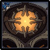

# Ruin Guard

|                                            |                                             |                                            |                                               |                                             |                                           |                                              |                                                |
| :----------------------------------------: | :-----------------------------------------: | :----------------------------------------: | :-------------------------------------------: | :-----------------------------------------: | :---------------------------------------: | :------------------------------------------: | :--------------------------------------------: |
|  |  |  |  |  |  |  |  |
|                     10%                    |                     10%                     |                     10%                    |                      10%                      |                     10%                     |                    10%                    |                      10%                     |                     **70%**                    |

## Tips and Mechanics

Ruin Guards have extremely high  **RES**. Avoid using abased carry. If you do, always bring **Superconduct** ( + )\*\* \*\*to reduce their resistance by **40%.**

### Weak Point

The **Ruin Guard** has two **weak points** - one on the **front** (eye) and another on the **back** in a similar location.

You must hit a weak point **two times in a row** to stun the **Ruin Guard**. If you miss the second shot, both **weak points** will become invulnerable for a short duration (**\~10s**)

After hitting a **weak point** once, notice how the **Ruin Guard** will tilt the eye slowly. It is difficult to hit the followup shot while it is tilted away and also moving. Try to time your second shot instead to when the **eye** faces back to you like in the example above.

## Abilities

### Jump Combo

The jump portion of the attack does the most damage. Focus on dodging that and not so much the punches.

### Missiles

Missiles will home towards the player. If you dodge too early, the missiles will end up still hitting you. Try to dodge at the very last moment to avoid them.

This attack will only be used if the player is a certain distance away from the **Ruin Guard**. It will not use it if the player is close by.

The **back weak point** is most exposed during the missile attack. Hit it and follow up with a second attack to stun the **Ruin Guard**.

### Spin

Hitting either **weak point** will interrupt the spin, but it can be difficult to time. **Freeze** can be an effective way of landing a **weak point** shot during a spin.
