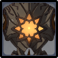

# Ruin Hunter

|                                            |                                             |                                            |                                               |                                             |                                           |                                              |                                                |
| :----------------------------------------: | :-----------------------------------------: | :----------------------------------------: | :-------------------------------------------: | :-----------------------------------------: | :---------------------------------------: | :------------------------------------------: | :--------------------------------------------: |
|  |  |  |  |  |  |  |  |
|                     10%                    |                     10%                     |                     10%                    |                      10%                      |                     10%                     |                    10%                    |                      10%                     |                     **50%**                    |

## Tips and Mechanics

**Weak Point** - Eye

Ruin Guards have extremely high  **RES**. Avoid using abased carry. If you do, always bring **Superconduct** ( + )\*\* \*\*to reduce their resistance by **40%.**

It takes a while for the **Ruin Hunter** to go into **Aerial Mode**. Try to do enough damage to destroy it before it lifts up. If you're not able to, make sure you bring a **Bow** character to disabled it when it flies.

**Ruin Hunter** attacks all have long windup animations, making them predictable. Learn the timings and dodge appropriately. They also have long durations between attacks, so use these windows to deal damage.

While slow, the attacks hit hard. If you're not skilled at dodging them, consider bringing a **shield** character to prevent being staggered by it's attacks.

Avoid using skills that put your character into the air (for example **Xiao's** **Burst**). If you are unable to be hit by the ground attacks, this will immediately trigger **Aerial Mode**. If you have a **Bow** character, you could also do this intentionally in order to stun it faster.

## Abilities (Ground)

### Slash

### Drill

### Combo Attack

Dodge towards the back of the **Ruin Hunter** to avoid the initial set of slashes. When it goes for the wheel attack, this will follow you again, so dodge one more time to the side.

### Aerial Mode

The **Ruin Hunter** will change modes after performing a few attacks on the ground.

This can also be initiated if the player gets themselves out of reach of the ground attacks - for example by jumping into the air with **Xiao**.

## Abilities (Air)

### Missile Barrage

### Gattling Gun

### Laser Combo

### Stunned

