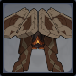

# Ruin Scout

## Resistances

|                                            |                                             |                                            |                                               |                                             |                                           |                                              |                                                |
| :----------------------------------------: | :-----------------------------------------: | :----------------------------------------: | :-------------------------------------------: | :-----------------------------------------: | :---------------------------------------: | :------------------------------------------: | :--------------------------------------------: |
|  |  |  |  |  |  |  |  |
|                     10%                    |                     10%                     |                     10%                    |                      10%                      |                     10%                     |                    10%                    |                      10%                     |                     **50%**                    |

## Tips and Mechanics

**Weak Point** - Eye Core

All of the **Ruin Scout's** attacks are **melee**. You should focus other enemies and let it come to you.

## Abilities

### Spin


Fast spin attack.


### Discharge


After a brief delay, triggers an energy explosion in an AoE.


### Mines


Drops a mine at the Scout's location.


If another **mine** is on the field, a beam of energy will connect the two and cause damage if the player passes through.

### Charge


Charges up, then charges towards the player.


The **core** is **exposed** while this attack is charging. Hit the weak point during to stun it.


