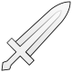

# Anemo Specter

|   |   |   |   |   |   |   |   |
| :---: | :---: | :---: | :---: | :---: | :---: | :---: | :---: |
| 10% | 10% | 10% | 10% |  **∞%** | 10% | 10% | 10% |

## Tips and Mechanics

**Weak Point** - None

Use ranged attacks or burst them down quickly to prevent losing time to healing.

## Rage

Specters have a **Fury Gauge** which builds up when hit by attacks that take a large portion of the Specter's HP.

When **enraged**, they will change their attack patterns, deal more damage, and explode in a larger AoE when killed.

## Abilities

### Homing Missile



### Swirl



This attack is only used if you get into melee range

### Triple Shot \(Enraged\)



### Detonate



If **enraged**, the **DMG** and **AoE** are larger, and it leaves behind a vortex which deals damage over time.



