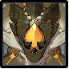

# Geovishap

## Resistances

|                                                                                                                                                                                                    Element | Resist |
| ---------------------------------------------------------------------------------------------------------------------------------------------------------------------------------------------------------: | ------ |
|     | 50%    |
| ​​​ | 30%    |
|                                                                                                                                                                                         ALL OTHER ELEMENTS | 10%    |

## Tips and Mechanics

**Weak Point** - Head

Geovishaps can become **infused with an element. Infusion adds elemental effects to attacks, as well as +20% Elemental RES, for a total of 30% RES** in that element.

Once **infused**, they will always carry their element (like **Slimes**). Use this to trigger beneficial reactions against them to your advantage.

While **infused**, Geovishaps are more resistant to **staggering.**

 \*\*infused \*\*Geovishaps can't be **frozen.**

Even though they are resistant to \*\* \*\*DMG, bringing a **Geo Support** can trigger \*\*Crystallize \*\*once they infuse, giving you shields against their attacks.

Having a \*\*shield \*\*active when they roll into you will cause them to be stunned briefly.

## Abilities

### Double Slam

Dodge out of the way before it lands. The best timing is to dodge just as the red circle reaches the edge.

### Slash

### Punch

### Rolling Slam

Dodge to the side of the roll, then dodge again when it slams down.

If you are \*\*shielded \*\*when they roll into you, it will stagger them briefly.

Dodging the roll can be difficult. If you are low on stamina, focus on dodging the **jump** portion of the attack, as it does a lore more damage.

If you are able to dodge the roll, it will stagger the Geovishap and prevent the followup jump attack!

### Spikes

### Infusion

Each Geovishap will always infuse to the same element

#### Pyro Infusion

#### Hydro Infusion

#### Cryo Infusion

#### Electro Infusion

