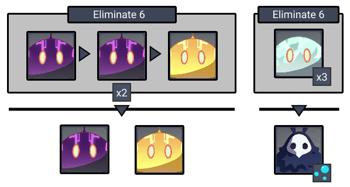
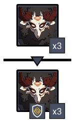
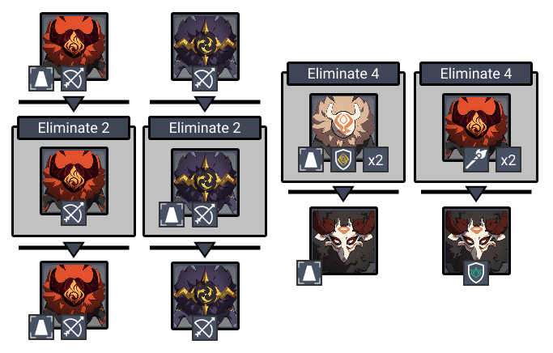
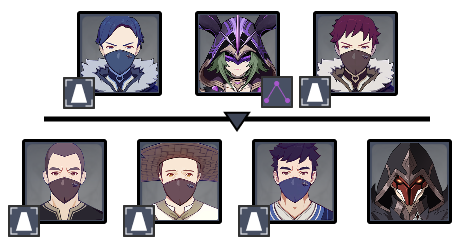
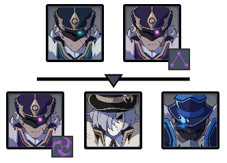
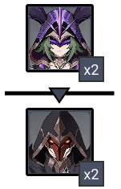

# Floor 11 \(v1.2 - 1.4\)

## Divergence

* Your character will be periodically inflicted with **Engulfing Storm**, continuously draining your Energy until the inflicted Electro element is remove
*  **DMG** dealt by all party members increased by **75%**

## General Tips

**Chongyun** can be a very effective support on this floor for either side if you normally run a Main Carry that relies on **Regular Attack**. He can turn their attacks into  to take advantage of the floor buff. If you do this, make sure you switch out the goblet of your main carry with a **ATK%** or **CRYO%** goblet.

**Bennet, Diona, Jean, Xinyan** can clear **Engulfing Storm** debuff.

Avoid **Barbara, Xingqiu** as they will cause **Electrocharged** on your characters and won't clear the debuff.



## Team Recommendations

|  | Side 1 | Side 2 |
| :--- | :---: | :---: |
| **Shieldbreakers** |  |  |
| **Preferred Damage** |  |  |
| **Avoid Damage** |  |  |
| **4**★ **Supports** |  |  |
| **5**★ **Supports** |  |  |

## Chamber 1

**Monster Level - 88**

### Side 1

| Aura | DMG |
| :--- | :--- |
| \*\*\*\*[**Bubbles**](../mechanics/auras/bubbles.md)\*\*\*\* | 3424 |

Getting hit by  causes **Electrocharged** which can stagger your character. Do your best to avoid these attacks.

 works well in this chamber to freeze **Hydro Slimes** and **Hydro Abyss Mages**, preventing them from attacking you.

Prioritize **Hydro Abyss Mage** once it spawns spawns in order to stop the **Bubbles**.

### Side 2

Attack the **Stone Shield Mitachurls** when they are attacking if you didn't bring anything to deal with the shields.

**Freeze** will also let you bypass their shields.

## **Chamber 2**

**Monster Level - 90**

### Side 1



There are several strategies you can use to beat this Chamber, but it is important to understand the aggro patterns of the mobs! Check out the various Video Guides above if you need help.

Your goal is to have **&gt; 80%** **HP** on the monolith after this side if you're going for a 3★. This will give you a good buffer and let you take a hit or two on the other side.

Any composition can defeat this floor with &gt; 80% HP if you understand how the mobs work. If you don't want to use a specific strategy in the Video Guides, try killing mobs in this order:

* Stone Shield Hilichurls \(4\)
* Axe Mitachurl \(spawns after Hilichurls\)
* Archers

While the **Archers** can damage the monolith, they attack fairly slow and only do about **2% HP / 5 seconds** from both archers. If you can kill the enemies quickly enough, this might be easier than worrying about aggro or blocking.

Another common strategy is to kill the initial **Pyro Archer**, and only that archer. Doing this makes sure the two archers in the chamber are targeting you. Focus the remaining enemies in the order listed above.

### Side 2



| Aura | DMG |
| :--- | :--- |
| [Electro Triangle](../mechanics/auras/electro-triangle.md) | 721  / Tick _\(8 ticks / second\)_ |

This side is slightly easier to manage than the first, but it is also important to understand the aggro patterns, so check out the various video guides.

**Hoarders** are easy to stagger. If you can group them together, continually attacking them will be enough to prevent them from hitting the Monolith. **Hoarders** should be prioritized as they focus the Monolith.

The exception is the **Gravedigger** in the second half. He will only throw dirt at the Monolith which does **no damage** and can be ignored.

Grouping the **Hoarders** together is an effective way to keep them staggered. You can do this with various **Anemo** skills, or try **Sword Charged Attacks** which throw enemies away from you too.

**Electro Cicin Mage** flies can go for the pillar, so try to fight her away from it if possible. Remember the **Electro Triangle** spawns where you are too, so keeping yourself far from the Monolith is safest.

**Pyro Agent** can do about **20%** of Monolith health in a single attack. Make sure you don't get the Monolith between you and the Pyro Agent when it attacks, or it will get hit.

## **Chamber 3**

**Monster Level - 92**

The stage will occasionally be struck by **Electro Storms**. These appear as AoE circles on the ground which trigger after a slight delay, doing  **DMG** and draining a very large amount of **Energy**. Avoid these as best as you can.

| Electro Storm |  |
| :--- | :--- |
| **DMG** | 1897   |
| **Energy Drain** | 40 Energy |

### Side 1

| Aura | DMG |
| :--- | :--- |
| \*\*\*\*[**Electro Triangle**](../mechanics/auras/electro-triangle.md)\*\*\*\* | 758 / Tick _\(8 ticks per second\)_ |

Focus the **Hydrogunner** in the second half as he can heal the others.

If you are going for 3★ on the chamber, try to down the **Hydrogunner** before he shields. If you do you can also skip bringing  on this team.

### Side 2

**Pyro Agents** can deal a lot of damage, particularly if both hit you at the same time. Make sure you look out for their attacks and dodge appropriately.

## Other Resources

Not sure what something means? Check the [Glossary](../floors/glossary.md)

