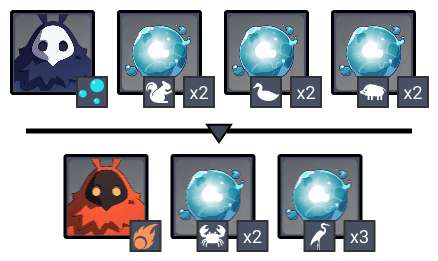
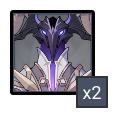
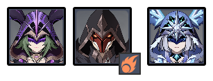

# Floor 12 \(v1.4 - v1.5\)

## Divergence

* No Divergence

## General Tips

Each Chamber/Side on this Floor has very different requirements. Focus on first clearing the Floor and then come back and build specific teams to 3★ each Chamber rather than trying to 3★ all Chambers in one go.

## Team Recommendations

|  | Side 1 | Side 2 |
| :--- | :---: | :---: |
| **Shieldbreakers** |  |  |
| **Preferred Damage** |  | \*\*\*\* |
| **Avoid Damage** | \*\*\*\* | \*\*\*\* |
| **4**★ **Supports** |   |  |
| **5**★ **Supports** |   |  |

## Chamber 1

**Monster Level - 96**

Keep an eye on the **Whopperflowers** during this fight. You should prioritize breaking their **shields** when they use them in order to stun them and prevent them from using an infused attacks.

Focus on the **Geovishap** to start, but you should switch to the **Whopperflower** if they are **stunned**. They take more damage in this form.

### Side 1

| Monster | HP |
| :--- | :--- |
| [Geovishap](../monsters/animals/geovishap.md) | ~400K |
| [Pyro Whopperflower](../monsters/animals/pyro-whopperflower.md) | ?? |

#### 3★ Tips

Useor **DMG** on this side, and avoid   **DMG**

### Side 2

 Geovishap can easily be frozen by  after infusion.

#### 3★ Tips

Useor  **DMG** on this side, and avoid   **DMG**

## Chamber 2

**Monster Level - 98**

### Side 1

Enemies will periodically be buffed by an **shield** which reduces incoming damage. The most effective way to remove it is with , but will also work.

**Cicins** are immune to any form of crowd control, making them difficult to group. Try to bring plenty of **AoE DMG** in order to effectively deal with them.

The combination of **potioneers** and **cicins** can trigger dangerous elemental reactions on your character. Try your best to avoid the ground effects created by **potioneers**.

The  **Hydro/Cryo Cicins** in the second wave can **freeze** you repeatedly. Be aware of this and try to aim the **cicins** first on that side.

#### 3★ Tips

Having a way to apply in a large area will help deal with the shield.

Even though **Cicins** aren't affected by **Crowd Control**, grouping the **hoarders** is still important. Try to fight near the **potioneers** and let the melee enemies run towards you.

| Recommended Characters |
| :---: |
|          |

### Side 2

| Aura | DMG |
| :--- | :--- |
| [**Bubbles**](../mechanics/auras/mist-bubble.md)\*\*\*\* | 4730DMG  |
| \*\*\*\*[**Fireball**](../mechanics/auras/pursuing-fireball.md)\*\*\*\* | 2512/ Explosion |

Each type of **Hydro Mimic** is weak to a different element \[[1](https://genshinhelper.gitbook.io/abyss/floors/spire/floor-12#references)\]. 

| Type | Weakness |
| :--- | :--- |
| Boar, Squirrel |   |
| Crab, Duck |   |
| Crane |   |

Bring  so that you can freeze **Hydro Mimics**. They do a significant amount of damage and can quickly kill characters when their attacks line up.

**Boar Hydro Mimics** will regenerate health over time. 

The **Crane Hydro Mimics** in the second wave to significant damage, particularly if you get affected by  from the **Pyro Abyss Mage**. Take them out before dealing with the other enemies.


Be careful using **Bennet** on this side! He will apply to your character, allowing the enemies to trigger **Vaporize** on you with their attacks, dealing heavy damage.


#### 3★ Tips

Run straight for the **Hydro Abyss Mage** and apply a burst that can keep it **Frozen** \(**Rosaria, Diona, Ganyu**\). The rest of the mobs will then run towards you and group together.

**AoE DMG** is particularly effective on the first side. Once the mobs have grouped, use these skills to try to take out the weaker **Squirrel and Duck Hydro Mimics** first.

Next, focus down the **Hydro Abyss Mage** so you can stop **Bubbles** from spawning.

In the second wave, run for the **Crane Hydro Mimics**. The other enemies will come to you.

| Recommended Characters |
| :---: |
|       |

## Chamber 3

**Monster Level - 100**

### Side 1

| Monster | HP |
| :--- | :--- |
| \*\*\*\*[**Abyss Lector**](../monsters/abyss-order/abyss-lector.md)\*\*\*\* | ~735K HP |


The **Abyss Lector shield** has **36U** of strength. This means it takes anywhere between **18~36** applications ofto break the shield, depending on how strong the ability is at applying the element. are half as effective, requiring **36~72** applications.


Use against the **Abyss Lector** shield. 

While the above 3 elements are equally effective, there are morechars with good elemental application, so using it is preferred.

Taunts are particularly effective at drawing their attacks and giving you windows to deal damage.

#### 3★ Tips

This side can be particularly difficult due to the shields. Aim for around **2 minutes** on this side and try to bring a team that can clear the second half in under a minute.

**Abyss Lectors** will not move during their attacks if you stay within range. You can use this to your advantage by grouping them together before using damaging skills. While unshielded, they are easily staggered, for example with **sword charged attacks**. Use this to push them together as close as possible.

You can also group the **Lectors** by walking to one side of the arena at the start of the fight. This takes about **10-12s** to do and can be worth it if you have no other way to group them quickly.



Once **shielded**, **Abyss Lectors** will no longer be moveable. Keeping them together is extremely important when going for stars. **Reactions** triggered on one shield \(**Overload, Superconduct**\) will damage the other shield if they are close enough.

Try using **Bennett** with **4pc Thundering Fury**. Every use of his **Elemental Skill** triggers **Overload** on the **Abyss Lector** shields, which reduces the cooldown by **1 second**. Since his elemental skill already has a low cooldown, this lets you use it very frequently to quickly damage the shield.

If you have both **Bennett** and **Jean**, you can use their **Elemental Bursts** together to trigger **Swirl** \(+\). This causes **AOE** **DMG once per second** around you, which can also deal quick damage to shields.

| Recommended Characters |
| :---: |
|         |

### Side 2

| Aura | DMG |
| :--- | :--- |
| \*\*\*\*[**Fireball**](../mechanics/auras/pursuing-fireball.md)\*\*\*\* | 2512/ Explosion |

Aim for the **Pyro Agent** first to get rid of the **Fireball** aura.

Having some form of **Crowd Control** helps greatly on this side.

#### 3★ Tips

When going for a fast clear, aim for the **Cryo Cicin Mage**. Keeping her staggered prevents her from shielding and saves you time. You can use attacks to try and push her closer to the other enemies and group them.

| Recommended Characters |
| :---: |
|       |

## Other Resources

Not sure what something means? Check the [Glossary](../floors/glossary.md)

## References

1. [Genshin Fan Wiki](https://genshin-impact.fandom.com/wiki/Rhodeia_of_Loch)

